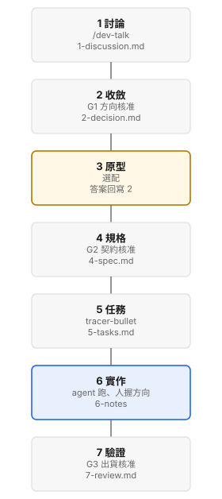

# dev-flow

七站開發流程，給 agent 跑、人還握著方向（不拿走控制，不像 GSD／BMAD 整包代操）。

## 安裝（約 30 秒）

在**產品專案根目錄**跑官方 `dev-setup`（不是 Claude `/plugin update`）。
主機技能樹在這台機器掛一次。

方法包是一份正本；每個專案只從 setup 拿到 `docs/dev/`。

```
dev-setup
```

<p align="center">
  
</p>

## 開始

[quickstart](https://rick546986.github.io/dev-flow/guides/guide-quickstart.html)

## 為什麼

人握方向、契約、出貨三道閘；契約與清單在 quickstart，不在這張入口。

<details>
<summary>機械正本（檢查器抽這裡；人看 guide）</summary>

hook 要 python3（只吃標準函式庫，**編譯下限 3.9**）。hook 找直譯器的順序是
`DEVFLOW_PYTHON` → `/usr/bin/python3` → PATH 上的 `python3`。
gate-twin／產圖要 `markdown-it-py==4.0.0`，該套件要 **Python 3.12+**。
macOS `/usr/bin/python3` 常是 3.9，裝不出 4.x、會靜默停在 3.x。
用專案 venv 或設 `DEVFLOW_PYTHON` 指向 3.12+，**不要覆寫** Apple 系統 Python。
產圖直譯器順序:`DEVFLOW_PYTHON` → 專案 `.venv` → `/usr/bin/python3` → PATH。
doctor／upgrade 會查這件事。四邊安裝／更新 → [docs/PLUGIN.md](docs/PLUGIN.md)。
主機發現 → [guide `#host`](https://rick546986.github.io/dev-flow/guides/guide-dev-flow.html#host)。
feat worktree 的 `docs/dev` 雙生頁要併回專案真正在用的整合線(常是 develop／testing),不要只留在 worktree。

## 3. 七份文檔(用途一句話;骨架見 `_templates/`,填好範例見 `example/`)

| # | 檔 | 用途 | Gate |
|---|---|---|---|
| 1 | `1-discussion.md` | 發散:把「不知道自己不知道」變成可收斂的問題清單。不做決定 | Open Questions 全解或明標假設 |
| 2 | `2-decision.md` | 收斂:2-3 方案比較 → 選定 + rejected + 理由 | **G1** 方向核准 + OC 全裁決(全文見 §7) |
| 3 | `3-prototype.md` | 選配:throwaway 實驗回答技術/UI 疑問,答案回寫 2-decision。 | 答案回寫 2-decision + frontmatter 收尾同步(終態 approved) |
| 4 | `4-spec.md` | 本次變更的可測契約(delta + GIVEN/WHEN/THEN)。SDD 真相 | **G2** R/S 全審 + DD 全裁決 + Verification Profile + Demo verdict(全文見 §7) |
| 5 | `5-tasks.md` | 切成可勾選任務,tracer-bullet 順序,每 T 有 Covers/Files/Verify/Blocked-by | 每 T 欄位完整 |
| 6 | `6-implementation-notes.md` | 實作日誌:TDD 證據 + 偏差記錄 | 每 T review PASS + 全 S 綠 |
| 7 | `7-review.md` + `.html` | 雙軸審 + coverage matrix + Exit checklist;出貨樹=審過的樹。 | **G3** 本次 S 全綠 + 回歸綠 + 現象證據 + Evidence 契約全過(全文見 §7);PASS → Exit Checklist(PR 是其中一項) |

**Design Boundary Contract**(4-spec 內的條件式章節,不是第八份文檔):補的是
4-spec(可測契約)到 5-tasks(可勾選任務)之間缺的設計邊界。
**十一條觸發條件任一命中即必填,全未命中才可 `n-a` + 具體理由(Fast lane 不豁免)**;
條件全文與判準**不在此重抄** ——
操作用清單在 `_templates/4-spec.md` 該節頂註,
語意判準與好壞範例在 `notes/design/design-boundary-contract.md`(母版 repo,唯一語意正本);
兩份由 `scripts/check-design-contract.sh` 機械比對。由既有 G2 一併審(gate 條件正本仍是 §7)。

## 4. ID 追溯鏈

每張票用同一個 id 串起來。全文見 [flow `#filemap`](https://rick546986.github.io/dev-flow/guides/guide-dev-flow.html#filemap)。

`R-n`(requirement,4-spec)→ `S-n`(scenario,4-spec)→ `T-n`(task,5-tasks,標 Covers)
→ 測試名含 S-id(6 實作)→ `D-n`(deviation,6)→ `F-n`(finding,7,標影響的 S/T)。

裁決用 ID **不入鏈**:`OC-n`(2-decision)、`DD-n`(4-spec)不被 T 實作。

## 5. 實作期鐵則

契約 / 檢查器抽(Stage 6 seam):

```text
RED → GREEN → scope check → Verify
→ independent T review
→ PASS
→ commit
→ Progress Log + checkbox + review evidence
```

T 在獨立審查 PASS 前一律未完成。分不清 L1/L2 → 一律當 L2。

契約 / 檢查器抽(七支掛載 hook 名):

掛載中的 hook 必須被點名:`devflow-guard`、`devflow-prebash`、
`devflow-dispatch-guard`、`devtalk-guard`、`devflow-report-guard`、
`devflow-postbash`、`devflow-plainspeak`(另有 `history-guard` 守 HISTORY,不受旗標影響)。
L1 出口 = `devflow-exec.sh allow`;L2 = `stop`。

**驗證五律**(適用 T 執行、T review 與各 gate):
1. **證據 = 原始輸出**:完成/通過必附原始指令輸出或 檔案:行號。
2. **派工者不下場修**:修復一律重派執行者、重新送審。
3. **反預判禁令**:派工 prompt 禁止預先框定 reviewer 判斷。
4. **HITL 不可代答**:gate / Owner Call / L2 不得由 agent 代答。
5. **失敗先分類再路由**:SPEC → L2;ENV → 修環境不計升階;IMPL/UNKNOWN → 升階。同 T 上限 4(haiku 1 + sonnet 2 + opus 1)。

## 6. HTML twin(可視化)+ Artifact

契約 / 檢查器抽(審查動線頂區五格;標籤逐字釘死,由 `check-gate-twin.sh` 驗):

| 站 | 五格內容(標籤逐字釘死,由 `check-gate-twin.sh` 驗) |
|---|---|
| **2-decision(G1)** | 判定(`## Decision` 首句)/ Owner Calls(已裁決 `x/y`)/ 方案(幾項待審)/ 駁回理由(幾條)/ 狀態(frontmatter) |
| **4-spec(G2)** | 狀態(frontmatter)/ 待審 S(幾條 + **幾條缺觀測欄**)/ lane · Risk / DD 進度 `x/y` / Demo verdict(承接 3-prototype) |
| **7-review(G3)** | 判定(frontmatter `verdict:`)/ 出貨(Exit Checklist `x/y`)/ 爭點(「附錄:本輪特有」幾條)/ 風險(Known Limits 幾條)/ 抽驗(Coverage Matrix 中位列 `檔:行`,決定論、可重現)|
| **5-tasks(執行板)** | 狀態(frontmatter)/ 任務(幾個 T + 幾條缺必填欄)/ 模式(execution.mode,未標=sequential)/ 依賴(幾條 Blocked-by 邊)/ 進度(可勾計數) |

審頁產檔器 `scripts/build-stage{1,2,5,7}-html.py`;第 6 站 `scripts/build-stage6-html.py`。
正本 `notes/design/stageN-review-ui-contract.md`。不進 gate-twin STAGES。
站審 html 掛 Pages(真的 html 頁,不是倉庫原始碼):正本 `notes/design/pages-hosting.md`。本機 `python3 scripts/devflow_gate.py serve --root .`。

## 7. 角色與 Gate

三道閘。粗體詞是過關條件,檢查器在抽,不要改字。

去哪:[flow `#gates`](https://rick546986.github.io/dev-flow/guides/guide-dev-flow.html#gates)

> **本節 = gate 條件(G1/G2/G3)的契約句**。各一句過關條件在下;全文、強制力對照、回滾導覽見
> [flow `#gates`](https://rick546986.github.io/dev-flow/guides/guide-dev-flow.html#gates)。
> 改任何 gate 條件先改這裡的粗體 token 與錨定義,再同步三處摘要:①plugin `dev-flow`
> SKILL.md 階段動作表 ②本 README §3 七份文檔表 ③對應模板頂註。衝突以本節為準。

契約 / 檢查器抽(四眼與 reviewer 選法;下列第一條 `- ` 原文勿改):

- **author ≠ approver**:G1/G2/G3 的核准者不可以是該文檔的 owner(四眼原則)。
- **審查者產生**:G1/G2/G3 一律依序選 **適格人類 reviewer → fresh-context reviewer
  Agent → owner 自審(有記錄的最後手段)**。Agent 必須是乾淨 context,只給審核對象+基準+回報格式,不給
  作者結論;verdict 與審者身分記 reviewers 欄(如 `[independent-fresh-context-reviewer]`)
  + 檔內留 round 紀錄。owner 自審僅能作為**有記錄的最後手段**,不假裝有四眼。
- **規劃層 git**:每過一個 gate,把該階段文檔 commit 一次,只含文檔。Stage 1–5 落在整合分支;Stage 6 才開 feature branch。細節見 [flow `#gates`](https://rick546986.github.io/dev-flow/guides/guide-dev-flow.html#gates)。
- 機械錨點註記:以下 G1/G2/G3 定義句內的粗體詞組是 gate-consistency 機械比對錨;增改 gate 條件務必加粗。

 ### G1

方向對不對。2-decision 過了才能往規格走。

契約 / 檢查器抽:

G1 = 方向對不對(2-decision:方向核准 + **Owner Calls 全裁決**,有未裁決 OC
  不得過;下層內部技術項告知即可,但 reviewer **須抽查下層清單有無該上未上的
  誤放** —— 抽查是規則要求,不是 reviewer 自由心證)。

 ### G2

契約寫得對不對。4-spec 的 R/S、DD、Profile、Demo 都要過。

契約 / 檢查器抽:

G2 = 契約寫得對不對
  (4-spec:**R/S 全審 + Drafting Decisions 全裁決** + **Verification Profile**
  + **Demo verdict**,有未裁決項不得過;兩錨的條件式定義見下方「G2 錨定義」)。

- G2 錨定義(錨句在上;此處為條件式全文):
  - 「Verification Profile」:G2 必須確認 4-spec Verification Profile 已依 lane 正確
    填寫 —— full lane = 完整 Profile(Feature Risk/Failure Model/Negative Constraints/
    Required/Conditional/Explicitly Excluded/Final Fresh Entry Point);fast lane =
    最小 Profile(五欄,見 4-spec 模板);命中「自動升 Full」清單(見 4-spec 模板)
    仍寫 fast → 不得過。`lane: fast` 配 `Risk: high` → Runtime(start 時)、模板檢查
    與 Gate 一律拒絕,例外僅限 Owner Call 明示。
    Reliability triage 不計入上述五個最小 Profile 欄位,但 full 與 fast lane 都必須回答
    Concurrency、Idempotency、Timeout/retry 三問(格式與規則見 4-spec 模板);fast lane
    多半三項皆 `n-a`,理由仍不得省。本項由本 repo 腳本驗欄位存在與理由非空,理由是否
    成立仍是 G2 reviewer 的判斷,無 Runtime 機械強制。
  - 「Demo verdict」(條件式):無 Stage 3 trigger → N/A + 明確原因,可過 G2;
    有 trigger 且完成 Demo → 必須 `Human verdict: ACCEPTED`;REVISE → 不得過 G2,
    必須重做 Demo;NOT_REVIEWED → 不得過 G2;有 trigger 但跳過 → 必須有 Owner Call
    明示。Agent 不得自行填入 ACCEPTED;Runtime 必須拒絕 Agent 自產的 ACCEPTED。

 ### G3

做出來的對不對。測試綠不夠,還要現象證據跟 Evidence 八點。

契約 / 檢查器抽:

G3 = 做出來的對不對(7-review:**本次 S 全綠** **+ 既有測試套件全綠**(回歸義務)
  **+ 現象證據逐 S 相符** + **Evidence 契約全過**(八點定義見下方「G3 錨定義」)——
  reviewer 照 4-spec 的「觀測方式」親自實跑,測試綠不等於看得到它動起來)。

契約 / 檢查器抽(G3 錨定義八點;Gauntlet 版本句原文勿改):

- G3 錨定義:「Evidence 契約全過」= 以下八點全部成立:
  1. Final Fresh Run 綁定目前受審的 source SHA,且該 SHA 必須等於送審當下 HEAD;之後任何程式碼 commit 作廢 G3,必須重跑 Final Fresh。
  2. 所有 Required Layer = pass。
  3. 所有已觸發的 Conditional Layer = pass。
  4. 不得存在任何 fail。
  5. Required Layer 不得為 unverified 或 n-a。
  6. Explicitly Excluded Layer 可為 n-a,但必須附理由。
  7. Optional Layer 可為 unverified,但必須誠實標示。
  8. Gauntlet PASS 不取代 Standards Axis / Spec Axis / Operational Walkthrough /
     Coverage Matrix / 真實現象複驗。

  八點中的 Evidence 文件契約由 `scripts/devflow-evidence-gauntlet.sh`(1.3.3,E1–E13;
  採用專案散發於 `docs/dev/tools/`)機械驗證;第 2、5 點由 Gauntlet 讀 4-spec
  Verification Profile 的 Required layers(旗標 `--require-layer` 只能加嚴,不能拿掉
  Required;漏帶不再 fail-open;`--review-file` 找不到 Profile 亦不得退回 1.2.0;
  Profile 必須有 Required layers 欄,可寫「無」/none/n-a;缺欄或空值都紅;層名
  strip 後全等,不得 substring;`--profile` 只准本 feature
  的 4-spec,不得跨份覆寫)。
  第 3 點:Evidence 表已列且非 n-a 的 Conditional
  必須 pass;未列入視為未觸發,仍由 Reviewer 核對 Profile 條件。第 1 點的 HEAD
  綁定:`--review-file` 漏帶 `--source-sha` 時預設當下 HEAD;`docs/dev/<feature>/7-review.md`
  即使顯式傳 `--source-sha` 也必須等於 HEAD(example/ 與 scripts/fixtures/ 不套)。
- frontmatter 是狀態機:`draft → in-review → approved → superseded/shipped`。

### 強制力對照(誰在擋)

「規則存在」不等於「Runtime 會擋」。

本 repo 的 reference test 全綠 ≠ 外部 Runtime pass。Gauntlet 只驗 Evidence 契約,
自己不跑專案測試。

### 合併後出事怎麼辦(整合分支回滾) · 機械契約,可跳

合併後出事,預設 revert,不要硬補。下面算法只在「直接補修」例外才用,可跳。

去哪:[flow `#gates`](https://rick546986.github.io/dev-flow/guides/guide-dev-flow.html#gates)

> **契約 / 檢查器抽**
>
> 預設 `git revert -m 1 <merge commit>`;禁對整合分支 `reset --hard` /
> `push --force` / `rebase`。例外「直接補修」必須同時滿足:①一個 commit 修得完;
> ②補修 diff 與「其他 feature 碰過的檔」零交集。

契約 / 檢查器抽(直接補修算法;順序與原文勿改):

「其他 feature 碰過的檔」的定義(判準②用):**目前列在 `docs/dev/STATUS.md` Active
表裡的每個 feature 各自改過的檔的聯集**。逐列判定順序**寫死如下,不得跳步、不得倒序**:

1. `git fetch` 後先把**整合分支**釘成 SHA(它是活的 ref,算到一半被人推新東西
   就前後不一致)。
2. **Stage 1–5 且 `Branch` 欄逐字等於 `n-a:尚未建立 branch` 才跳過**(還沒有程式碼
   改動,本來就沒有戰場);Stage 1–5 但那欄不是這個 sentinel(或空)→ fail-closed
   停下問人,不當「跳過」。
3. **Stage 6 一律 fail-closed**:Active 表只要還有另一個 feature 的 `Stage` 是
   `6-implementation`(或同義的 Stage 6 值),就**不准用「直接補修」判準** ——
   執行中的 feature 本地可能還有未 commit/未發布的工作,remote 天生不能證明完整
   戰場。不要嘗試靠猜最新 T 補洞;走上面的預設回滾,或等它到 Stage 7。
4. **只有 Stage 7 的列才進 mode/ref/SHA 驗證**,而且全部讀 pinned remote tree:
   - 該列的補修座標是 STATUS/runtime 提供的單一 `OverlapRef`
     (`scripts/status-update.sh --print-overlap-ref` 印出的那一個;
     sequential 時這個座標**就是** `Branch` 遠端 ref;parallel 在
     integration 合回 feature 並 push **之前**是已發布的
     `integration/<slug>` tip,合回並 push **之後**變成 `Branch`)。
     用 `git rev-parse --verify` 把這**一個**座標釘成單一 `<remote-tip>`。
     直接補修只讀這一個座標,不得另猜第二個 ref,也不得在 feature tip 與
     integration tip 之間自行挑選。
   - 後續 mode、Progress Log 與 diff **全部讀這個 SHA,不准讀目前
     main checkout 裡可能尚未合併的舊副本**。
   - `Feature` 連結只用來導出該 feature 的相對路徑;兩份文件分別用
     `git show <remote-tip>:docs/dev/<slug>/5-tasks.md` 與
     `git show <remote-tip>:docs/dev/<slug>/6-implementation-notes.md` 取得。
     任一路徑不存在、逃出 feature 目錄或讀取失敗 → fail-closed 停下問人。
   - **mode 的唯一資料源是上面 pinned tree 讀出的 `5-tasks.md` frontmatter
     `execution.mode`**,不是 STATUS 的 `Lane` 欄(full/fast 跟
     sequential/parallel 是兩件事)。整塊缺省視為 `sequential`。
     明寫 `parallel` 且 `OverlapRef` 解不出來一律 fail-closed 停下,
     不宣稱零交集;不得把 Lane 當 mode,也不得為了湊出座標去猜
     `integration/<slug>`。連結/檔案/frontmatter 無法解析也停。
   - **sequential**:從 pinned tree 的 6-notes **Progress Log** 讀出**每一個**
     ACCEPTED T 的 commit SHA,逐個通過
     `git merge-base --is-ancestor <accepted-sha> <remote-tip>` 才算發布完整
     (remote tip 可以是 bookkeeping commit 的後代,**不要求 SHA 相等**;
     也**不得只查最新一個**)。Progress Log 缺失、SHA 解析失敗、任一 SHA 未包含
     於 remote tip → fail-closed。
   - 全部通過後才對該列取
     `git diff --name-only --no-renames $(git merge-base <remote-tip> <整合分支SHA>)..<remote-tip>`,
     全部取聯集;補修 diff 與聯集有交集 → 不適用「直接補修」,走上面的預設回滾。
5. 排除正在評估的補修自己 —— 它跟自己必然 100% 交集,不排除永遠算出「不適用」。
6. 表裡列著但 ref 不存在(打錯字、branch 被刪)→ 停下問人,不當空集合略過 ——
   「沒有交集」的結論不能建立在漏算上面。
7. **執行補修者自己的 checkout 也必須 clean、無 ahead 未推的 commit**;上面任何
   一條無法觀測(fetch 失敗、表解析不了、狀態看不到)就**不准宣稱零交集**。

⚠️ revert 之後的坑:**revert 一個 merge commit 之後,重新 merge 同一個 branch 不會
生效** —— git 看的是祖先關係,revert 只是加一個反向 commit,不改變「那些 commit
已在歷史裡」的事實。不要以為 revert 完再 merge 一次就好;要讓那個 feature 回來,
只有兩條路:

- **revert the revert**:`git revert <那個 revert commit>`,再補修。
- 從整合分支**重新開一個 branch**,把改動重做成新 commit。

## 8. 導覽

每站清單與模型對照見 [flow](https://rick546986.github.io/dev-flow/guides/guide-dev-flow.html)。

- **G1/G2/G3 審查與 verdict**:依 §7 的人類→fresh-context reviewer Agent→有記錄的
  owner 自審順序;Agent 只要求乾淨 context、審核對象、基準與回報格式,不指定模型。

retrieval status:`OK` / `NEEDS_VERIFICATION` / `CONFLICT` / `NO_RELIABLE_MATCH`。

</details>

<!-- devflow:master-only:start -->
母版目錄與檔案地圖在 [guide `#filemap`](https://rick546986.github.io/dev-flow/guides/guide-dev-flow.html#filemap)，不要在入口重畫樹。
<!-- devflow:master-only:end -->
