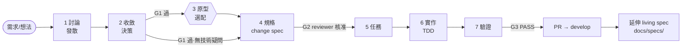

# dev-flow — 開發流程 SOP

> AI 協作的開發流程。
>
> **本 repo 同時是方法論母版與 Claude Code plugin**(v3.0.0 起合併,marketplace 名、
> plugin 名、repo 名都是 `dev-flow`)。裝法見 [`docs/PLUGIN.md`](docs/PLUGIN.md)。
>
> 新專案採用:裝好 plugin 後在專案內打 `dev-setup`,它會把 `_templates/`、本 README、
> `devflow-contract.json` 與 gauntlet 腳本散發進 `docs/dev/`、建 `STATUS.md`,
> 並建置 **Agent Memory**(`.dev-flow/` 可 Git 同步的長期記憶 + 本機索引;見 §18)。
> **不需要手動複製,也不需要本 repo 存在於使用者機器上。**
>
> **環境需求**:dev-flow 的 hook 需要 python3(僅標準函式庫),**最低 3.9**
> (= macOS 內建 `/usr/bin/python3` 的版本;下限由 `scripts/check-py-floor.sh` 逐檔
> 真編譯釘住,改下限要同時改該檔的 `PY_FLOOR`)。直譯器解析順序:
> 環境變數 `DEVFLOW_PYTHON`(顯式覆寫)→ 系統 `/usr/bin/python3` → PATH 上的
> `python3`。**找不到時 fail-open**:hook 印一行警告後放行,只跳過守衛、不擋工具
> 呼叫 —— 代價是那次呼叫沒有保護,不是功能壞掉。**Windows(Git Bash)沒有
> `/usr/bin/python3`,要另外裝 Python 並確認 `python3` 在 PATH 找得到,或設
> `DEVFLOW_PYTHON` 指向直譯器**,守衛才會真的生效。
>
> **維護本 repo 另外要裝一個套件**(採用專案不用)。上面那句「僅標準函式庫」只管 hook;
> **本 repo 自己的檢查腳本**(`scripts/render-methodology-corrections.sh`、
> `scripts/check-gate-twin.sh`、`scripts/build-gate-twin.py`)要 `markdown-it-py`,
> **版本釘死**、裝錯版直接失敗:`pip install -r scripts/requirements-methodology-render.txt`
> (整份就一行 `markdown-it-py==4.0.0`)。沒裝的症狀是
> `ModuleNotFoundError: No module named 'markdown_it'`。要換直譯器跑這幾支就設
> `DEVFLOW_RENDER_PYTHON`。hook 本身**刻意不 import 它**——採用端沒有 pip,見
> `hooks/devflow-lib.py` 保守 stdlib 規則那段註解。
>
> **已知限制:Windows 上跑不出全綠**(2026-08-19 實測,已排進待修清單)。Git Bash 的
> `/tmp` 實際指向使用者的暫存資料夾,但 Windows 原生 Python 把 `/tmp` 解成磁碟機根目錄下的
> `\tmp` —— **測試腳本把樣本寫到一個地方、回頭驗的時候看另一個地方**。後果:
> `hooks/selftest.sh` 321/392、`scripts/devflow-check.sh all` 四組全紅、
> `devflow-exec.sh doctor` 判 INCOMPATIBLE。**紅的就是這三項，其餘照樣綠**——
> `gate-consistency` 14/14、`test-architecture-guards` 83/83 都過。**這不是退步**:同一台機器跑 2026-08-19
> 動工前的版本是 314/378,逐條比對「原本會過、現在失敗」為 0 條。
> **代價是發版不能在 Windows 上做** —— `dev-release` 要求三道驗證全綠,而且明文禁止
> 以「這條跟本次改動無關」放行。完整證據與修法排程見
> [`notes/dispatch-windows-parity.md`](notes/dispatch-windows-parity.md)。

**這是什麼**:一套讓「討論 → 決策 → 規格 → 實作 → 驗證」全程留痕的文檔管線。每個
feature 走 7 份文檔、過 3 道 gate(G1 方向核准、G2 契約審查、G3 驗證出貨),AI 負責
產出、人負責裁決。解決的痛:需求討論完就散、spec 與程式碼漂移、AI 改動無法審計、
決策半年後沒人記得為什麼。

## 你是誰,該讀哪裡

本檔同時是**規則正本**(gate 條件、七階段規則、切片規則)與**查詢手冊**,不是拿來
從頭讀完的。三種讀者各有各的入口:

| 你是誰 | 從這裡開始 | 不要一開始就讀 |
|---|---|---|
| **第一次接觸 dev-flow** | ①[quickstart 導覽](https://rick546986.github.io/dev-flow/guides/guide-quickstart.html)(零到一,照著打)②[dev-flow 導覽](https://rick546986.github.io/dev-flow/guides/guide-dev-flow.html)(七階段圖解)③本檔 [§0 一張圖](#0-一張圖) + [§10 新 feature 快速上手](#10-新-feature-快速上手) | §5、§7 —— 那是規則正本,不是教學 |
| **要查某條規則** | 下方「規則索引」直接跳;最高頻三處:[§7 gate 條件](#7-角色與-gate)、[§2 lane 判準](#2-兩軌lane)、[§13–14 切片](#13-大案與切片) | 從第一節順讀 |
| **要改 dev-flow 本身** | ①母版「怎麼逛這個 repo」結構圖(每個目錄標了「誰在讀它」;散發版此節已依標記剝除,僅母版可見)②[§7 強制力對照](#強制力對照誰在擋)(哪些規則真的有人擋、哪些只是紀律)③[§7 頂註](#7-角色與-gate)的四處同步清單 | 直接改 §7 —— 先看它連動誰 |

**規則索引**(問題 → 章節):

| 想知道什麼 | 去哪 | 這節是正本嗎 |
|---|---|---|
| G1/G2/G3 各要什麼條件才過 | [§7](#7-角色與-gate) | ✅ **唯一正本**,改這裡要同步四處 |
| 這件事該走 full 還 fast | [§2](#2-兩軌lane) | ✅ |
| 七份文檔各放什麼、各卡哪個 gate | [§3](#3-七份文檔用途一句話骨架見-_templates填好範例見-example) | 摘要;gate 條件全文在 §7 |
| 哪個檔放哪種資訊(記憶/specs/adr/dev) | [§1](#1-文件地圖四象限-status-看板) | ✅ |
| 實作期怎麼推進、偏差怎麼判 L1/L2 | §5 | ✅ |
| 守衛擋我了怎麼辦 / 並行怎麼開 | §5 執行守衛、守衛與並行 | ✅ |
| 哪一站用哪個模型、錯了怎麼升階 | [§9](#9-模型分層與-effortai-執行時) | ✅ |
| 哪些階段要另開 session | [§10](#10-新-feature-快速上手) Session 邊界表 | ✅ |
| 為什麼討論不能知道下游 | [§11](#11-資訊隔離anti-premature-convergence) | ✅ |
| html twin 每站要放什麼圖 | [§6](#6-html-twin可視化-artifact) | ✅ |
| 案子太大要不要切、能不能切 | [§13](#13-大案與切片) 訊號 / [§14](#14-spec-切片單份-4-spec-過大時) 切點判準 | ✅ |
| R/S/T/D/F 這些 id 怎麼串 | [§4](#4-id-追溯鏈) | ✅ |
| 某條規則到底誰在擋(機械 vs 人工) | [§7 強制力對照](#強制力對照誰在擋) | ✅ |
| Agent 的長期記憶怎麼運作(`.dev-flow/`)| [§16](#16-agent-memorydev-flow) | ✅ |
| 跨 repo / 非 feature 的事怎麼辦 | [§17](#17-附錄跨-repo-與非-feature-入口) | ✅ |

<!-- devflow:master-only:start -->
圖在 `guides/`,不在這裡 —— 本檔是 markdown 正本,要圖請點上表的導覽連結。

**怎麼逛這個 repo**:每個目錄後面標的是「誰在讀它」——那就是它不能被刪的依據。
想刪任何東西前先跑 `grep -rn "<路徑>" hooks/ skills/ scripts/ _templates/ README.md`,
零命中才考慮。

```text
dev-flow/
│
├── ── 制度正本(改這裡等於改規則)──────────────────────────────
│   README.md                本檔。§7 是 G1/G2/G3 條件的唯一正本
│                            └ 讀者:gate-consistency.sh 每次動態抽 token 比對四處
│   devflow-contract.json    方法論 ↔ runtime 的版本握手
│                            └ 讀者:devflow-exec.sh doctor,缺件 fail-closed
│   _templates/               七階段模板 + STATUS/ADR/living-spec/html-shell
│                            └ 讀者:dev-setup 散發進每個專案;parity 檢查比對 guides
│   notes/design/ (6)        各機制設計正本(並行/觀測/gauntlet/real-world/boundary)
│                            └ 讀者:dev-setup SKILL 指 evidence-gauntlet.md 為契約正本
│   docs/prompts/ (2)        改造 dev-flow 本身的需求正本
│                            └ 讀者:notes/ 底下 8 處寫「需求正本: docs/prompts/…」
│
├── ── Claude Code plugin(裝進使用者機器的部分)────────────────
│   .claude-plugin/          plugin.json(版本字串=更新判斷依據)+ marketplace.json
│   hooks/                    守衛與執行引擎
│     ├ hooks.json           掛載清單,壞了守衛全靜默失效
│     ├ devflow-guard.sh     PreToolUse 讀寫守衛(未武裝時對 Stage 6 文件軟擋一次)
│     ├ devflow-exec.sh      執行引擎 + doctor 版本握手
│     ├ gate-consistency.sh  從 README §7 抽 gate token,比對 SKILL/README §3/三模板
│     ├ selftest.sh          守衛自測(案數以腳本輸出為準)
│     └ devflow_obs_vendor/  observability/ 的 vendored 副本(hooks 不能依賴 repo 相對路徑)
│   skills/ (5)              dev-flow(路由器)/ dev-run(Stage 6 引擎)/ dev-setup(安裝器)
│                            / dev-release(發版器)/ dev-talk(訪談引導)
│
├── ── 機械檢查(CI 與本機都跑這些)─────────────────────────────
│   scripts/                  單一入口 devflow-check.sh all,全過 = REPO_REFERENCE_PASS
│                            devflow-evidence-gauntlet.sh 是 Stage 7 證據檢查的母版
│   observability/            Attempt Ledger 工具(devflow-obs)+ agent_event schema
│                            └ 讀者:selftest.sh:1539 直接讀它,刪了 p3 段就壞
│   tests/parallel-stage6/   T 級並行的可執行契約(contract_ref + fixtures)
│   .github/workflows/       devflow-ci(REPO_REFERENCE)+ runtime-selftest(EXTERNAL_RUNTIME)
│                            兩層不互相代表,一邊綠不代表另一邊綠
│
├── ── 給人看的 ────────────────────────────────────────────
│   example/contract-…/ (14) 一個 feature 走完七階段的真實形狀(md + html twin 各 7 份)
│                            └ 讀者:renderer fixed-point 檢查逐位元組比對那四份 html
│   guides/ (4)              圖解導覽 html(GitHub Pages 指這裡;根目錄舊 redirect stub
│                            已移除,舊 Pages 網址直接改指 guides/,見 README 上方連結)
│   docs/PLUGIN.md           plugin 安裝與更新說明
│   manifests/ (4)           四軌改造的工單記錄
│   notes/ (其餘)            稽核、導入回饋、驗證對標
│
└── ── 本 repo 自己的改版流程(dogfooding)──────────────────────
    docs/dev/                本 repo 用自己的流程管自己
      ├ STATUS.md            Active / Backlog 兩張表(做完的不留這裡)
      ├ HISTORY.md           改版歷史索引(只增不改;唯一寫入口 scripts/history-append.sh)
      ├ devflow-contract.json + tools/  dev-setup 的散發副本(doctor 在這裡找)
      └ <slug>/              各次改版的七階段文檔
    docs/adr/                長期決策,一決策一檔(可被後來的 superseded)
```
<!-- devflow:master-only:end -->

線上看導覽:[quickstart](https://rick546986.github.io/dev-flow/guides/guide-quickstart.html)、
[dev-flow](https://rick546986.github.io/dev-flow/guides/guide-dev-flow.html)、
[dev-talk](https://rick546986.github.io/dev-flow/guides/guide-dev-talk.html)。
repo 內任一 html(含 example 的 twin)都可把路徑接在 `rick546986.github.io/dev-flow/`
後線上檢視。

**採用方式**:最低配是把模板複製進專案、人工照本 README 走流程;裝 plugin 後可用
`/dev-talk`、`/dev-flow`、`dev-setup`、`/dev-release` 指令自動導引與守衛。

## 0. 一張圖



## 1. 文件地圖(四象限 + STATUS 看板)

| 檔 | 回答什麼 | 生命週期 | 誰寫 / 誰讀 |
|---|---|---|---|
| `.dev-flow/`(repo root) | **Agent Memory**:這個詞是什麼意思(domain)、現在實際怎麼運作(implementation truth)、打算往哪走(intent)、當初為何這樣選(decision)、怎麼做某件事(skill)、以前發生過什麼(event) | 永生,可 Git 同步 | dev-talk 確認後由 `dev-memory.py` 寫入(**禁手改**)/ 全隊 + 每個 AI session(見 §18) |
| `docs/specs/<domain>.md` | 系統**現在**的行為(唯一真相) | 永生,只由階段7出口併入 | 7-Exit / 動這塊前必讀 |
| `docs/adr/NNNN-slug.md` | 當初**為何**這樣選 | 永生,可 superseded | 2-decision 晉升 / 想翻案的人 |
| `docs/dev/STATUS.md` | 誰正在做什麼、還有什麼沒做 | 常駐看板,做完的移出 | 每過 gate 更新 / 全隊 |
| `docs/dev/HISTORY.md` | **做過什麼、當初為什麼做** | 永生,只增不改(append-only) | ship 時由 `history-append.sh` 追加(**禁手改**)/ 想知道某件事怎麼變成現在這樣的人 |
| `docs/dev/<feature>/1-7` | 這次變更的完整生命週期 | ship 後封存 | 流程產出 / reviewer + 考古 |
| `.claude/rules/*.md` | 架構不變量/技術慣例/坑(Claude Code 官方規則路徑,無 `paths` frontmatter 者每 session 自動載入) | 永生 | setup 產草稿 / 全員+執行引擎;**只放 gotchas,禁流程規則(§11),spec 不重抄**;CLAUDE.md 對應段改指標避免雙正本;檔案長大(>~100 行)或多技術棧時可用 `paths:` frontmatter 做 path-scoped 按需載入(判準見模板頂註) |

一句話:**.dev-flow=Agent 記憶、specs=現況、adr=過去、dev/=進行中**。
(`.dev-flow/` 與 `docs/dev/` 分工見 §18:前者是給 Agent 的結構化記憶,
後者是給人看的專案文檔;`.devflow/`(無連字號)是本機執行期暫存,不進 Git。)

**歸位規則**(init 與全程):文檔不散落 `docs/` 根。

| 這種東西 | 歸到哪 |
|---|---|
| living 規格 / 規則 / 資料字典 | `docs/specs/` |
| feature 過程檔(1–7) | `docs/dev/<slug>/` |
| 長命決策 | `docs/adr/` |
| 流程外草稿 | `docs/dev/<slug>/0-draft-<名>.md` —— **只當 Stage 2 原料,不得跳關當 spec** |

既有散檔由 /dev-flow init 偵測,徵得同意後 `git mv` + 同步全部引用(code 註解/文檔/
CLAUDE.md;舊路徑 grep 歸零才算完)。

## 2. 兩軌(lane)

| | Full lane | Fast lane |
|---|---|---|
| 判準 | 新能力 / 不可逆改動(schema、API 契約、跨模組介面) | bugfix / ≤2 檔小改 / 行為已有 spec 條目(可逆的跨模組小改也算) |
| 文檔 | 1→7 全套(3 選配) | `4-spec`(補 bug scenario) → `5-tasks`(mini) → `6-implementation-notes` → `7-review`(mini) |
| Gate | G1 G2 G3 | G3(spec 改動大再補 G2) |
| 起手式 | Stage 1 討論(`/dev-talk`) | **診斷迴圈**(mattpocock×superpowers 聯集):重現 → 最小化 → 假設 → 驗證定位 → 修 → 回歸測試 |
| bug scenario 從哪來 | — | 從「重現步驟」直接長出:GIVEN=重現前置 / WHEN=觸發 / THEN=正確行為。**修根因,禁 symptom patch** |
| Stage 5 | 兩軌同一份 `_templates/5-tasks.md` | **不省略**;可只有一個 T,但 `Covers`/`Files`/`Verify`/`Blocked-by` 四欄必填 |

拿不準 → Full。被流程煩到 → 檢討判準,不要繞過流程。
Fast lane 省的是 Stage 1–3,不是 Stage 5:`devflow-exec.sh start <slug>` 會逐 T 驗那四欄,
並從這份 `5-tasks.md` 解析 Git repository root 相對的 `Files` scope,少一欄就開不了工。

## 3. 七份文檔(用途一句話;骨架見 `_templates/`,填好範例見 `example/`)

| # | 檔 | 用途 | Gate |
|---|---|---|---|
| 1 | `1-discussion.md` | 發散:把「不知道自己不知道」變成可收斂的問題清單。不做決定 | Open Questions 全解或明標假設 |
| 2 | `2-decision.md` | 收斂:2-3 方案比較 → 選定 + rejected + 理由 | **G1** 方向核准 + OC 全裁決(全文見 §7) |
| 3 | `3-prototype.md` | 選配:throwaway 實驗回答技術/UI 疑問,答案回寫 2;命中觸發判定(前端/交接/核准/等待/權限/系統外/多互動設計)→ 條件式必要,產可操作 Demo + User Demo Feedback(Human verdict 人類親填) | 答案回寫 2-decision + frontmatter 收尾同步(終態 approved) |
| 4 | `4-spec.md` | 本次變更的可測契約(delta + GIVEN/WHEN/THEN)。SDD 真相 | **G2** R/S 全審 + DD 全裁決 + Verification Profile + Demo verdict(全文見 §7) |
| 5 | `5-tasks.md` | 切成可勾選任務,tracer-bullet 順序,每 T 有 Covers/Files/Verify/Blocked-by | 每 T 欄位完整 |
| 6 | `6-implementation-notes.md` | 實作日誌:TDD 證據 + 偏差記錄 | 每 T review PASS + 全 S 綠 |
| 7 | `7-review.md` + `.html` | 雙軸審 + coverage matrix + Exit checklist。**同 stage 只有這兩個檔**,自審的家在 6-notes Self-Review;真要用 7-review 形狀寫自審則 verdict 填 `PRE-REVIEW`,獨立 reviewer 產出後**就地接管同一個檔**、不另存 sibling(細則見模板步 0a) | **G3** 本次 S 全綠 + 回歸綠 + 現象證據 + Evidence 契約全過(全文見 §7);PASS → Exit Checklist(PR 是其中一項) |

**執行清單四原則**(Stage 2/3/4/5/6/7;清單全文住各模板頂註,Stage 1 同款機制內建於
/dev-talk):①開場第一動把清單建成 todo,每步有「完成 =」客觀條件,達成才勾;
②交審前必過自檢步 —— 產物勾稽、附證據,不憑印象;③禁跳項、禁併項;
④完成條件達不成 → 回上游步驟補,不硬過。

**Design Boundary Contract(4-spec 內的條件式章節,不是第八份文檔)**:補的是
4-spec(可測契約)到 5-tasks(可勾選任務)之間缺的設計邊界 —— 責任歸哪個模組、
資料歸誰、依賴往哪個方向、跨模組介面與一致性邊界在哪、測試接縫留在哪。
**十一條觸發條件任一命中即必填,全未命中才可 `n-a` + 具體理由(Fast lane 不豁免)**;
條件全文與判準**不在此重抄**,以免變成第三份會漂的清單 ——
操作用清單在 `_templates/4-spec.md` 該節頂註(填的人就地看得到),
語意判準與好壞範例在 `notes/design/design-boundary-contract.md`(母版 repo,唯一語意正本);
兩份由 `scripts/check-design-contract.sh`(母版 repo)機械比對條數與關鍵詞,不得單邊漂移。
由既有 G2 一併審(gate 條件正本仍是 §7,本段不新增 gate 條件),不新增 Stage、
不新增 Gate、不新增 ID 鏈;Stage 5 用既有 `Boundaries:` 欄摘錄、
Stage 6 在 T Review 查 drift、Stage 7 併入既有雙軸審。強制力見 §7 對照表。

## 4. ID 追溯鏈

`R-n`(requirement,4-spec)→ `S-n`(scenario,4-spec)→ `T-n`(task,5-tasks,標 Covers)
→ 測試名含 S-id(6 實作)→ `D-n`(deviation,6)→ `F-n`(finding,7,標影響的 S/T)。

Reviewer 靠這條鏈機械檢查「每條需求都有測試」,不靠肉眼。

裁決用 ID **不入鏈**:`OC-n`(2-decision)、`DD-n`(4-spec)不被 T 實作,不參與
「需求→測試」勾稽;OC 被推翻 = 上游修訂(改 2-decision,連動後續 R/S),非鏈上斷點。

## 5. 實作期鐵則:不打斷、自主推進(源:Anthropic「Finding your unknowns」field guide)

實作中**不打斷問人**,靠三條規則自主推進、事後可稽核。每個 T 一律照同一條
acceptance seam,手動實作與 `dev-run` 不得各自另訂順序:

```text
RED → GREEN → scope check → Verify
→ independent T review
→ PASS
→ commit
→ Progress Log + checkbox + review evidence
```

本節規則速查(全節是正本,下表只是入口):

| 撞到什麼 | 看哪一條 |
|---|---|
| 這個 T 什麼時候才算完成 | 檢查點 |
| Stage 6 驗到哪、Stage 7 驗什麼 | 分層 |
| spec 沒寫的細節可以自己決定嗎 | Decisions |
| 做到一半發現跟 spec 不合 | 偏差兩級(分不清 → 判級疑義:**一律當 L2**) |
| 要改 `Files` 以外的檔 | Scope guard → 執行守衛的 `allow` / `stop` |
| 守衛怎麼武裝、擋什麼、怎麼收尾 | 執行守衛 |
| 多 feature 或多 T 同時跑 | 守衛與並行(正解 = 各開 worktree)、T 級並行 |
| G3 把我打回來了 | 接收審查 |
| 同一個 T 一直失敗 | 驗證五律 第 5 條(先分類再路由,上限 4 次) |
| 這件事誰有權拍板 | 自判分層表 |

- **檢查點**:T 在獨立審查 PASS 前一律未完成、不得 commit。reviewer 必須不同於該
  T 的 implementer;優先由適格人類 reviewer 審,否則派 fresh-context reviewer
  Agent。reviewer 必須親自跑該 T 的 Verify,並檢查 Covers、RED→GREEN 證據與
  **該 T 自己的 Files scope**。FAIL 回同一 T 修正後重新送審;尚未取得後續 PASS
  就維持未完成。高風險或 findings 有爭議時可加第二位 reviewer。PASS 後才做一 T
  一 commit(可逐點回滾),再把 hash、checkbox 與 review evidence 寫入 6-notes 的
  Progress Log / T Review Log。
- **分層**:上述是 Stage 6 的逐 T acceptance seam;Stage 7 G3 仍是獨立的 feature-level
  gate,不被 T review 取代或重複。Stage 6 只跑快速 Task-local 驗證,即上述 seam 的
  RED → GREEN → scope check → Verify → independent T review(Test Integrity Check
  是 T review 的檢查清單擴充,不是新階段;「Candidate」僅 parallel 模式使用,
  sequential 案照舊 = 送 T review);mutation/property 等重驗證層屬
  feature 級 Final Fresh Run,**不逐 T 跑**。純 migration／infra 型 T(無業務邏輯可斷言)
  一樣要有 RED→GREEN,只是測的是**形狀**(表/欄位/索引/約束存在與否),不能只寫執行指令
  就算完成(細節與範例見 `_templates/5-tasks.md`)。
- **Decisions**(spec 未載明的自由選擇,如內部命名、資料結構):自己選、記一行入
  6-notes 的 Decisions 節、繼續。不屬偏差,不需回審。
- **偏差兩級**:
  - **L1 計畫內偏差**(不動任何 R/S):選**保守方案** → 記 Deviations(D-n:現象/
    保守選擇/理由/影響)→ **繼續執行**。(= field guide 原版 prompt)
  - **L2 契約偏差**(要改 R/S 或推翻 2-decision):**停**。修訂 `4-spec.md` → 重新
    G2 → 才能繼續。禁止 silent drift —— spec 說謊,SDD 就死了。(本 SOP 加嚴,
    field guide 無此級)
- **起手式**:開 feature branch 才動工;多 feature 並行用 git worktree 隔離,免互踩。
- **Scope guard**:改動檔案 ⊆ 5-tasks 全部 T 的 Files 聯集;Files 一律以 Git repository
  root 為相對根,`internal/x_test.go` 和 `backend-go/internal/x_test.go` 在 monorepo 是不同
  scope。超出 → 依偏差兩級判(不動 R/S = L1 記錄續走;動到 = L2 停)。
- **執行守衛**(機械強制,dev-flow plugin 內建):Stage 6 起手在工作樹跑
  `hooks/devflow-exec.sh start <slug>`(驗 4-spec=approved、逐 T 驗 Covers/Files/Verify/
  Blocked-by、正規化 Files → 產 scope 快照 + 契約 hash)。start 前只容許 scope 內髒檔;
  scope 外的 tracked/untracked/ignored 真實改動一律拒啟,先 commit、還原或改用乾淨 worktree,
  不再收進 baseline。`.DS_Store`、`._*`、`Thumbs.db`、`__pycache__/`、`*.pyc` 是 ambient
  metadata:不進 baseline、不擋 start/post-Bash,也不需 allow;其餘路徑即使被 `.gitignore`
  忽略仍會掃描。旗標存在期間下列 hook 生效(另有 `history-guard` 全程守
  `docs/dev/HISTORY.md` 單一寫入口,不受旗標狀態影響):
  `devflow-guard`(PreToolUse Edit|Write|Read:擋改任何 feature 的 1/2/3/4、擋讀 1/2/3、
  擋 scope 外寫入)、`devflow-prebash`(PreToolUse Bash:擋 shell 讀上游與破壞旗標)、
  `devflow-postbash`(PostToolUse Bash:git status 對照 + 內容 hash,抓 shell 寫入)、
  `devtalk-guard`(盲原則掃描)、`devflow-dispatch-guard`(PreToolUse Task|Agent:武裝中
  擋「首派即最高階」派工)。另有 `devflow-report-guard`(PostToolUse Edit|Write:
  只掃 `.devflow/reports/*.md` 缺陷回報檔的結構性識別特徵,與旗標狀態無關,
  非回報路徑一律靜默)與 `devflow-plainspeak`(UserPromptSubmit:每輪注入一段
  「用白話繁體中文回」的提醒,讓要在 G1/G2/G3 拍板的人看得懂自己在核准什麼。
  規則文字的**唯一正本**是 `hooks/plainspeak-rules.md`,hook 讀它、不自帶副本;
  個人帳號那邊要用同一套規則就指回這個檔,不要另存一份。
  **預設關閉**,設 `DEVFLOW_PLAINSPEAK=1` 才啟用;不擋任何東西,與旗標狀態無關)。
  L1 出口 = `devflow-exec.sh allow <file> --reason`;
  L2 = `stop`。收尾 `stop` 後全部沉睡。自測:`hooks/selftest.sh`(動態發現案例,可重跑)。
  界線:紀律工具非安全沙箱,詳 `dev-setup-record.html`(plugin guides/,經
  `${CLAUDE_PLUGIN_ROOT}` 存取,非本 repo/散發檔案)。跨版本相容由
  `devflow-exec.sh doctor` 依 `devflow-contract.json`(2.0.0)做 fail-closed 握手;
  舊 sequential 專案 = legacy compatibility mode。
- **不對稱保護(第 6 型假綠)**:修法只套用在觸發它的那個實例,沒有推廣到同類的
  其他實例 —— 這種病在本 repo 已發作過三次(PINNED_PAT 缺 `Decision` 只補一站、
  盤點型守衛只跟著某個新資料格長、第 2 層對帳只推廣到單一 stage)。制度要求:
  **新增任何只對某個 stage/某個檔/某個群組的保護時,必須在同一個 commit 裡說明
  為什麼其他同類不需要;說不出來就是不對稱,要嘛推廣、要嘛寫明限制並列進
  Backlog。**(源:`notes/dispatch-guard-symmetry.md`)
- **不對稱記帳(第 7 型)**:保護機制長大了,所有 runtime 消費端都對,唯獨「為了
  驗證/健檢而**列舉**它的那份文件」靜默不同步,而且沒有任何檢查在比對兩者
  (實例:hooks 掛載長到 6 條,dev-setup 健檢清單停在 5 條 —— 採用專案照清單健檢,
  會把線上真實存在的 hook 判成「多出來的」;更難看的是同一份檔案自己寫過「案數以
  腳本輸出為準,不在本檔寫死」)。與第 6 型的差別:修法本身是對稱的,漏的是
  **記帳**。制度要求(通解):**任何「為了驗證而列舉某個機械事實」的清單,必須有
  一支守衛對著機械正本對帳(數量與名稱都比,漏列/多列/數字過期皆紅);沒有守衛
  釘著的清單不得寫死數字。**現有對帳守衛:hooks 掛載 = `check-hooks-accounting.sh`、
  檔案地圖 = `check-file-map.sh`、selftest 案數 = MIN_CASES 地板、散發副本 =
  check-gate-twin N7、gauntlet 版本 = `check-version-sync.sh`。新增這類清單時,
  要嘛納入既有對帳守衛,要嘛同 commit 補新守衛。
  **實例二(註解裡的分解式)**:`check-file-map.sh` 的註解寫過
  「77 = hooks 22 + observability 17 + scripts 36 + tests 2」,常數從 77 調到 78 時
  分解沒跟著改,而且那個分解在調整之前就已經算錯(hooks 實際 25、scripts 實際 34)。
  守衛比的是常數不是註解,錯的分解照樣全綠,但下一個做同樣記帳的人會照著它算。
  **通則的延伸:註解裡的分解式也是「為了驗證而列舉的清單」,同樣受本條約束 ——
  沒有守衛釘著就不要寫,要數字就跑一次。**這一條不另立守衛(什麼算「分解式」機械
  判定不出來:訂窄了沒用、訂寬了天天假陽性,而它只會誤導人、不會讓檢查變綠)。
  (源:`notes/dispatch-accounting-symmetry.md`、`notes/dispatch-status-commit-landing.md`)
- **守衛與並行**:守衛狀態以「當前工作樹」為單位(`.devflow/exec.json` + git-dir sentinel),
  一個工作樹同一時間只武裝一個模組。武裝中他模組 `start` → 一律拒絕(不靜默覆寫);
  同模組重跑 `start` = re-arm,允許(5-tasks 改動後重釘 scope 的正常路徑)。
  **多模組並行的正解是各開 git worktree**:每個 worktree 有獨立 toplevel 與 git-dir,
  守衛互不相見 —— 模組 A 在 worktree 甲跑 Stage 6 時,模組 B 在 worktree 乙寫 spec、
  跑自己的 Stage 6,零互擋。並行時 STATUS.md 只在整合分支(`develop` 或 `main`,
  依專案)上維護,worktree 內一律不碰 —— 規則與理由見 `_templates/STATUS.md` 頂註。
  同一工作樹內硬要並行做不到:武裝期間跨 feature 的
  1/2/3/4 契約檔一律受保護(hooks 分不清寫入來自哪個 session,fail-closed)。
  同 feature 內 T 級並行 = 每 T 各開 task worktree(`task/<slug>/T-n`,同 Wave 同
  Base SHA),守衛以 `--task` 釘單 T scope;仍然是「一工作樹一武裝」,不破例。
- **T 級並行(選配,同一 feature 內)**:`5-tasks.md` frontmatter 明寫
  `execution.mode: parallel` 才啟用(缺省 sequential,行為不變)。並行 seam 變體:
  RED → GREEN → scope check → Verify → **Candidate Commit(task branch)→
  Mechanical Gate → 整合(按 integration DAG)→ Wave/Dedicated Review → ACCEPTED**
  → 派工者記帳。核心規則:未 Review 的程式碼可形成隔離 Candidate Commit,但未過
  Review 的 Candidate 不得進正式 integration branch、不得標完成;只有 ACCEPTED
  才勾 checkbox。每 T 一個 task worktree(`task/<slug>/T-n`)+ task-scoped 守衛;
  Worker 不寫 5-tasks/6-notes/STATUS/twin(單寫者 = 派工者)。細節與欄位語意見
  `notes/design/parallel-stage6.md`(母版 repo)。全流程一張圖(ASCII 正本;SVG 版見
  `guides/guide-quickstart.html` ③,plugin guides/,經 `${CLAUDE_PLUGIN_ROOT}` 存取):

  ```text
  Task DAG → Wave Base → Task Worktrees
  → RED/GREEN/Verify(每 T 一個 task worktree,各自跑 seam)
  → Candidate(task branch,不可變)
  → Mechanical Gate(14 項機械檢查)
  → 整合(按 integration DAG)
  → Dedicated Review(Task high,整合前)或 Wave Review(normal,整合後)
  → ACCEPTED(才勾 checkbox、才記帳)
  ```

  跨階段收束(sequential/parallel 皆同;Final Fresh Gauntlet = §7 G3 錨的
  Final Fresh Run + Evidence 契約,SVG 版見 `guides/guide-quickstart.html` ⑥,
  plugin guides/,經 `${CLAUDE_PLUGIN_ROOT}` 存取):

  ```text
  ACCEPTED Tasks → Final Fresh Gauntlet → G3
  ```

  runtime 子命令:`parallel-init` / `plan` / `wave-open` / `wave-close` /
  `task-candidate` / `task-state` / `task-integrate` / `task-rework` /
  `rebuild-plan` / `candidate` / `gate` / `review`,詳 `devflow-exec.sh` usage 與
  `notes/design/parallel-stage6.md`(母版 repo)。
- **接收審查**(G3 打回時):逐 F 驗證後才動手 —— 同意的改並一句說明為何對;
  不同意的擺論證,不盲改(禁 performative fix)。
- **判級疑義**:分不清 L1/L2 → 一律當 L2。Diff Budget 超支本身非偏差,
  是停下判級的訊號。
- **Demo verdict**(Stage 3→4 流程規則):3-prototype Human verdict ≠ ACCEPTED 的
  互動 S,4-spec 不得將其標記定案(列 Drafting Decisions 待裁決或退回 Stage 3
  重新 Demo)—— 屬 Stage 4 執行清單義務;NOT_REVIEWED ≠ ACCEPTED;
  gate 條件正本見 §7。

**驗證五律**(2026-08 對照 openspec/superpowers/mattpocock/harness-engineering
四家驗證機制後定案;適用 T 執行、T review 與各 gate):

1. **證據 = 原始輸出**:任何「完成/通過/綠了」宣稱必附**原始指令輸出或 檔案:行號**,
   禁「我跑過了」「應該過了」式自陳;review finding 必逐條引用 spec 原文或 diff hunk。
   (源:superpowers Iron Law、mattpocock paste-the-output)
2. **派工者不下場修**:主控(派工者)不得繞過 T review 親自修 finding —— 修復一律
   重派執行者、重新送審;主控 context 保持乾淨,主控親修 = 跳過 review 的漏洞。
   (源:superpowers controller-never-fixes;呼應本 SOP「不下場寫碼」)
3. **反預判禁令**:派工 prompt 禁止出現「不要標記 X」「X 最多算 Minor」「計畫已決定
   所以不算問題」等預先框定 reviewer 判斷的措辭 —— 發現自己正在寫,停手。
   (源:superpowers anti-prejudgment)
4. **HITL 不可代答**:需要人裁決的問題(gate 核准、Owner Call、L2 判定)不得由
   agent 代答或「合理推測使用者會同意」;沒有人的裁決就停在待裁狀態。
   (源:mattpocock wayfinder 反模式)
5. **失敗先分類再路由**:T FAIL 先歸類 —— **SPEC**(T/S 定義有問題)→ L2 停,回 G2;
   **ENV**(環境/依賴壞)→ 修環境重跑,不計升階;**IMPL/UNKNOWN** → 走 §9 升階鏈。
   同 T 總嘗試上限 = 4(haiku 1 + sonnet 2 + opus 1),用盡**強制** adviser 裁決,
   禁無限重試;分類與升階史記 6-notes 執行軌跡。(源:harness-engineering failure
   category + loop budget)

**自判分層**(同字不同義,先分清):
| 名 | 誰拍 | 住哪 |
|---|---|---|
| Decision(方案決策) | **人** | 2-decision |
| Owner Calls(自判裁決) | owner,G1 全裁決 | 2-decision |
| Drafting Decisions(草擬自判) | 模型,G2 全裁決 | 4-spec |
| Split Decisions(拆分自判,選配) | 模型 | 5-tasks |
| Decisions(實作自判) | 模型,7 審對照 | 6-notes |

## 6. HTML twin(可視化)+ Artifact

**重生規則**:md = git 正本,html twin = 衍生視覺版、**隨時可重生**
(dev-talk 內稱「視覺版」,同一物 —— 盲故那邊不用 twin 一詞)。gate 時必產;
**Stage 5 於 tasks 定稿(供 start 解析/派工)時必產、Stage 6 於全 T 完成
(bookkeeping commit 前)必產 —— 1~7 每階段終態皆有 twin,不因「本階段無 gate」省略**;
草稿期遇到**分歧點**(模型自判待裁決、方案分叉)必重生,且「⚠️ 待裁決」區置頂。
你對著 html 在對話裁決(「D-3 ✗,理由…」)→ AI 改 md → html 重生。
`1-discussion.html` 由 /dev-talk 收尾即產(殼在 skill 目錄,防破盲)。

**圖規則(全域)**:每站 html 至少一張圖,**判準看關係形狀**:
- 純線性步驟 / 單層樹 → ASCII(md code block,html `<pre>`,git-diffable;
  **限半形字元** `| - + > < = [ ]` —— 全形框線與中文不參與欄位對齊,瀏覽器 pre
  全形寬度不定必歪,中文只放行首標籤/行尾註)
- 方塊+連線的空間關係(多層模型/時間軸/分支交錯/跨層互動)→ **inline SVG 真圖**
  (block+線條+箭頭)。拿不準 → SVG。
禁外部庫。md 永遠留 ASCII 正本,html 依判準選渲染。
畫法規範(顏色變數/class 約定/佈局紀律,不依賴任何 skill 或本機軟體)見
`_templates/diagram-style.md`;新圖先抄現成範本結構再改節點。

**Per-stage 規格表**:

| twin | 審查形狀 | 必含圖 | 分歧/自判區 | diff |
|---|---|---|---|---|
| 1-discussion | 文件 | 脈絡圖 | OQ+假設 badge、驗收雛形表、Real-world Context 表 | — |
| 2-decision | **審查介面(G1)** | 方案架構圖(比較期可並排) | Approaches+Rejected、Owner Calls(待裁決置頂) | — |
| 3-prototype | 文件 | variant 流程/結構圖 | Demo Script、User Demo Feedback(Human verdict 人類親填)、Verdict | — |
| 4-spec | **審查介面(G2)** | 行為流程圖(R 級) | Drafting Decisions(待裁決置頂) | — |
| 5-tasks | **執行板** | T 依賴 DAG(ASCII 天生適合) | Split Decisions(選配) | — |
| 6-notes | 文件 | progress 時間線(選配) | Decisions+Deviations 表 | ✅ 每 T commit |
| 7-review | **審查介面(G3)** | 變更架構圖(動了哪些模組) | F-id 分級表 + **現象證據表**(逐 S 觀測 vs 實跑;前端截圖引 `evidence/`) | ✅ 全 branch |

**三種形狀的差別**(2026-08-15 補,起因見下方「審查動線頂區」;K-3 再補執行板一種):

| 形狀 | 哪幾站 | 給誰用 | 規格 |
|---|---|---|---|
| **審查介面** | 2-decision / 4-spec / 7-review —— 三個 gate 站 | 給人**審**,要逐條過並做出判定 | 動線頂區五格 + 待審項目逐條可勾 + 背景資料摺疊(見下) |
| **執行板** | 5-tasks | 給人**照著做**,動工前看 Intent 與四欄,動工時才展開 Boundaries | 動線頂區五格 + 任務卡逐條可勾＋缺必填欄紅底 + Boundaries 摺疊 + 依賴 DAG(見下「執行板頂區」) |
| 文件 | 其餘三站 | 給人**查**,找得到就好 | 現行文件形狀即可 |

判準一句:**這份 twin 存在的理由是不是「有人要對它做判定」** —— 是就是審查介面;
**「有人要照它動工」** —— 是就是執行板。

**Diff 細則**(6/7 的 html):每檔一個 `<details>` 折疊條 —— hover 顯示 stat 摘要
(+N/−N、動到的函式),click 展開完整 diff(紅綠著色);內容必 HTML-escape;
單檔 >400 行截斷留 stat+首段註「完整見 git」;base:6 = 該 T 的 commit,
7 = merge-base(develop)..HEAD。⚠️ **標題要寫實際用的 base** ——
merge-base 與「feature 開工前那個 commit」常常不是同一個(order-intake 實測相差
105 個 commit、檔數 202 vs 861),用了哪個就標哪個並寫原因,不要照抄本行的字面。

### 審查動線頂區(**三個 gate twin 一律必含**)

twin 不只是給人查的參考檔,gate 站的 twin 是給人**審**的。這三站的 html 必須做成
審查介面,三件事缺一不可:

1. **動線頂區**:頂部固定五格,每格一句話 + 一個跳轉。**審完五格才決定要不要往下讀。**
   格子內容依 stage 不同(見下表),但格數固定五格、每格必須可點跳到對應段落。
2. **待審項目逐條可勾**:該站要人逐條過的東西(G1 = 方案與 Owner Calls、
   G2 = 每個 S、G3 = 每條 F-id 與逐 S 現象證據)一條一張卡,可勾、有進度計數。
   **缺必填欄的項目要在卡上直接現形**——4-spec 缺 GIVEN/WHEN/THEN/觀測任一欄即紅底
   (動線頂區優先報缺觀測條數),不要只在別處列表。
3. **背景資料摺疊**:不是本次要審的東西(既有脈絡、附錄、骨架、預算表)一律收進
   `<details>`,預設收合、**內容零刪減**。摺疊是為了讓要審的浮出來,不是為了少寫。

| 站 | 五格內容(標籤逐字釘死,由 `check-gate-twin.sh` 驗) |
|---|---|
| **2-decision(G1)** | 判定(`## Decision` 首句)/ Owner Calls(已裁決 `x/y`)/ 方案(幾項待審)/ 駁回理由(幾條)/ 狀態(frontmatter) |
| **4-spec(G2)** | 狀態(frontmatter)/ 待審 S(幾條 + **幾條缺觀測欄**)/ lane · Risk / DD 進度 `x/y` / Demo verdict(承接 3-prototype) |
| **7-review(G3)** | 判定(frontmatter `verdict:`)/ 出貨(Exit Checklist `x/y`)/ 爭點(「附錄:本輪特有」幾條)/ 風險(Known Limits 幾條)/ 抽驗(Coverage Matrix 中位列 `檔:行`,決定論、可重現)|
| **5-tasks(執行板)** | 狀態(frontmatter)/ 任務(幾個 T + 幾條缺必填欄)/ 模式(execution.mode,未標=sequential)/ 依賴(幾條 Blocked-by 邊)/ 進度(可勾計數) |

> 2026-08-15 修正:此表初版寫了三格**文件裡根本沒有那筆資料**的東西
>(2-decision 的「影響面(動到哪幾個模組)」、4-spec 的「Gate 過了沒」、7-review 的
> 「第 N 輪」)—— 規格自帶不可滿足,產生器只能給別的值,於是規格與產出物從第一天就對不上
>(獨立審查 H5)。現在表內每一格都對應 md 裡真的抓得到的欄位,**標籤逐字被守衛比對**。
> 5-tasks(執行板)列是 K-3 追加,格式與判準同一套,只是不掛 G 編號。

**起因**(兩次,同一句話):order-intake 的 7-review 長到 95k 字,owner 問
「這麼雜要怎麼審、從哪開始」→ 2026-08-13 補了 7-review 的動線頂區。
2026-08-14 owner 打開 ivf_platform 的 `4-spec.html`(md 直轉、16 個 S 攤平在單欄長文),
第一句話是「這份給人看得有點雜亂」—— **同一個病,只是當時規格只綁了 7-review 一站**。
規範管的是「必含什麼元素」,不管「長什麼形狀」,所以採用端完全合規、產出仍然難審。
K-3(2026-08-15 再補):owner 兩次反映 5-tasks 直轉的 md **也是同一個病**——
Boundaries 常上千字,攤平會把 Covers/Files/Verify 擠出畫面,所以執行板另外
補了下方「執行板頂區」四件事,不是照搬 gate 站的三件事。

md 側的對應規定是各模板頂註(`_templates/{2-decision,4-spec,7-review,5-tasks}.md`),
**兩邊講同一件事、md 是正本**;html 只是把它做成可點的。

**產生方式**:`scripts/build-gate-twin.py <專案根> <slug> <stage>`(母版 repo 路徑;
採用專案的散發副本在 `docs/dev/tools/build-gate-twin.py`。`stage ∈
2-decision | 4-spec | 7-review | 5-tasks`;見該檔頂註)。它讀 md 正本逐條解析,
不手抄 —— 所以不會與正本漂移;解析不到任何一條會直接失敗,不會產出一份空殼。
相依 `markdown-it-py==4.0.0`,缺了會 fail-loud(exit 2 附安裝指令),不靜默降級。
**同一份內容兩種殼**:本機 twin 要完整 html 文件,上 artifact 的片段**不得含**
`<!doctype>`/`<html>`/`<head>`/`<body>`(發布時外層會自動包)。

要對外報告:跟 AI 說「這份 html 上 artifact」→ 發布成連結。
殼檔有兩處副本(`_templates/html-shell.html` 與 dev-talk skill 目錄內),改殼須同步兩處。

### 執行板頂區(**5-tasks 專屬**,K-3 追加)

5-tasks 不是 gate(無 G 編號、免 reviewer 核准),但一樣要讓人**照著動工**,
不是把 md 直轉攤平。四件事缺一不可:

1. **動線頂區五格**(規格見上表新增的「5-tasks(執行板)」列)。
2. **任務卡逐條可勾**:每個 T 一張卡,Covers/Files/Verify/Blocked-by 對齊、Intent
   獨立標色。**六欄必填**(Covers/Files/Verify/Blocked-by/Intent/Boundaries)缺任一
   即紅底現形,格式同 K-7(缺「X」欄);Owner 選配,`-`/`無`/空皆視為有值。
3. **Boundaries 摺疊**:卡內 `<details>`,預設收合、**內容零刪減**。
4. **依賴 DAG 由 Blocked-by 自動衍生**:拓撲分波(Kahn),ASCII 印在 `#dag`。
   引用不存在的 T → 該邊列進 stderr 警告、卡不紅(欄位本身有值);有環 → stderr
   列出環上 T、DAG 區印「(依賴有環:…)」,兩者都 fail-loud、都不擋產出。

md 側對應規定是 `_templates/5-tasks.md` 頂註,**兩邊講同一件事、md 是正本**。

## 7. 角色與 Gate

> **本節 = gate 條件(G1/G2/G3)的唯一正本**。改任何 gate 條件先改這裡,再同步
> 三處摘要:①plugin `dev-flow` 的 SKILL.md 階段動作表 ②本 README §3 七份文檔表
> ③對應模板頂註的送審/verdict 步(2-decision/4-spec/7-review)。摘要一律只寫
> 「關鍵條件一句 + 全文見 §7」,不重抄全文;衝突以本節為準。

- **author ≠ approver**:G1/G2/G3 的核准者不可以是該文檔的 owner(四眼原則)。
  無適格人類第二人不豁免下述 Agent fallback;只有前兩種 reviewer 都不可用時,owner
  才得自審 —— reviewers 留空即示無獨立審,留痕即可,不假裝有四眼。
- **審查者產生**:G1/G2/G3 一律依序選 **適格人類 reviewer → fresh-context reviewer
  Agent → owner 自審(有記錄的最後手段)**。Agent 必須是乾淨 context,只給審核對象+基準+回報格式,不給
  作者結論;verdict 與審者身分記 reviewers 欄(如 `[independent-fresh-context-reviewer]`)
  + 檔內留 round 紀錄。owner 自審僅能作為**有記錄的最後手段**,不假裝有四眼。
- **規劃層 git**:接手起手先看 `git status`,working tree 有與本 feature 無關的
  改動 → 回報使用者處置,不與文檔混流;每過一個 gate,把該階段文檔
  (`docs/dev/<slug>/` + STATUS + `.dev-flow/` 的記憶更新)commit 一次,只含文檔。尚未開
  feature branch 的規劃階段(1-5),文檔 commit 落在整合分支(`develop`)上(純文檔
  無程式碼,低風險;Stage 6 起手式才開 feature branch,見 §5);該整合分支有護欄擋
  直接 commit(branch protection / pre-commit hook)時,走短命 branch → commit →
  立刻 `merge --no-ff` 回去,**不要因此把文檔混進 feature branch**。
- 機械錨點註記:以下 G1/G2/G3 定義句內的粗體詞組是 gate-consistency 機械比對
  錨(dev-setup check 第 8 項);增改 gate 條件務必加粗,不加粗則不被機械驗證
  涵蓋。
- G1 = 方向對不對(2-decision:方向核准 + **Owner Calls 全裁決**,有未裁決 OC
  不得過;下層內部技術項告知即可,但 reviewer **須抽查下層清單有無該上未上的
  誤放** —— 抽查是規則要求,不是 reviewer 自由心證)。G2 = 契約寫得對不對
  (4-spec:**R/S 全審 + Drafting Decisions 全裁決** + **Verification Profile**
  + **Demo verdict**,有未裁決項不得過;兩錨的條件式定義見下方「G2 錨定義」)。
  G3 = 做出來的對不對(7-review:**本次 S 全綠** **+ 既有測試套件全綠**(回歸義務)
  **+ 現象證據逐 S 相符** + **Evidence 契約全過**(八點定義見下方「G3 錨定義」)——
  reviewer 照 4-spec 的「觀測方式」親自實跑,測試綠不等於看得到它動起來)。
- G2 錨定義(錨句在上;此處為條件式全文):
  - 「Verification Profile」:G2 必須確認 4-spec Verification Profile 已依 lane 正確
    填寫 —— full lane = 完整 Profile(Feature Risk/Failure Model/Negative Constraints/
    Required/Conditional/Explicitly Excluded/Final Fresh Entry Point);fast lane =
    最小 Profile(五欄,見 4-spec 模板);命中「自動升 Full」清單(見 4-spec 模板)
    仍寫 fast → 不得過。`lane: fast` 配 `Risk: high` → Runtime(start 時)、模板檢查
    與 Gate 一律拒絕,例外僅限 Owner Call 明示。
    Reliability triage 不計入上述五個最小 Profile 欄位,但 full 與 fast lane 都必須回答
    Concurrency、Idempotency、Timeout/retry 三問(格式與規則見 4-spec 模板);fast lane
    多半三項皆 `n-a`,理由仍不得省。本項由本 repo 腳本驗欄位存在與理由非空,理由是否
    成立仍是 G2 reviewer 的判斷,無 Runtime 機械強制。
  - 「Demo verdict」(條件式):無 Stage 3 trigger → N/A + 明確原因,可過 G2;
    有 trigger 且完成 Demo → 必須 `Human verdict: ACCEPTED`;REVISE → 不得過 G2,
    必須重做 Demo;NOT_REVIEWED → 不得過 G2;有 trigger 但跳過 → 必須有 Owner Call
    明示。Agent 不得自行填入 ACCEPTED;Runtime 必須拒絕 Agent 自產的 ACCEPTED。
- G3 錨定義:「Evidence 契約全過」= 以下八點全部成立:
  1. Final Fresh Run 綁定目前受審的 source SHA。
  2. 所有 Required Layer = pass。
  3. 所有已觸發的 Conditional Layer = pass。
  4. 不得存在任何 fail。
  5. Required Layer 不得為 unverified 或 n-a。
  6. Explicitly Excluded Layer 可為 n-a,但必須附理由。
  7. Optional Layer 可為 unverified,但必須誠實標示。
  8. Gauntlet PASS 不取代 Standards Axis / Spec Axis / Operational Walkthrough /
     Coverage Matrix / 真實現象複驗。

  八點中的 Evidence 文件契約由 `scripts/devflow-evidence-gauntlet.sh`(1.2.0,E1–E13;
  採用專案散發於 `docs/dev/tools/`)機械驗證;第 2、3、5 點仍須依 Verification Profile
  正確傳入 Required／Conditional layer(旗標漏帶會 fail-open),並由 Reviewer 核對 ——
  詳細強制邊界見下方對照表。
- frontmatter 是狀態機:`draft → in-review → approved → superseded/shipped`。
- 已知限界(明文接受,不另設機制):①Stage 1 討論期的自判無獨立節(單一機制
  原則,不在 1-discussion 設節)—— 由 2-decision 步 0 接手盤點「連同討論期自判
  一併清點」承接。②OC 的「若被推翻會怎樣」在 G1 時點是預估;4-spec 展開後發現
  代價估錯 → 回頭校準該 OC 的代價欄(不改裁決)。

### 強制力對照(誰在擋)

本 README 用肯定語氣寫規則,但「規則存在」不等於「Runtime 會擋」。下表把每項條件
的實際強制者分三類寫清楚,免得讀者把人工紀律誤讀成機械閘門。三類是:plugin runtime
(ADR-0001 之後併入本 repo 隨其散發,不再是獨立 repo;安裝後實際路徑為
`~/.claude/plugins/cache/dev-flow/dev-flow/<version>/`,Windows 對應
`%USERPROFILE%\.claude\plugins\cache\dev-flow\dev-flow\<version>\`;裝法見
[`docs/PLUGIN.md`](docs/PLUGIN.md))、本 repo 腳本(只驗本 repo 的模板/範例/fixture)、
人工或 fresh reviewer。

讀本表前先記三句:①本 repo 的 reference test 全綠 ≠ 外部 Runtime pass —— 兩者
用 `devflow-contract.json` 對版握手,不共用實作。②Gauntlet 只驗 Evidence 契約
(一份 markdown 有沒有照規矩填),它自己不跑專案測試,也不會發現你根本沒跑。
③Coverage Matrix 與 Operational Walkthrough 的內容對不對,永遠是 Reviewer 的判斷;
E11 只驗這兩節在不在。

| 條件 | 主要強制者 | 對應位置 |
|---|---|---|
| G1 方向與 Owner Calls 全裁決 | 人工/fresh reviewer;外部 plugin 管流程 Gate | 本節上方、`_templates/2-decision.md`、外部 plugin |
| G2 R/S、Drafting Decisions、Verification Profile、Demo verdict | 人工/fresh reviewer;外部 plugin 管流程 Gate | 本節上方、`_templates/4-spec.md`、外部 plugin |
| G1/G2/G3 摘要三處不漂 | 外部 plugin 機械比對本節粗體錨 | `hooks/gate-consistency.sh` |
| Stage 3 Human verdict 不得由 Agent 代填 | 人類輸入;外部 plugin 判定觸發與拒絕代答 | `_templates/3-prototype.md`、`hooks/_stage3_impl.py` |
| Stage 4 逐場對帳 Stage 3 ACCEPTED 場景 | 人工/fresh reviewer 為主;本 repo 腳本驗範例的對帳段存在性與逐場點名(不判內容對錯) | `_templates/4-spec.md` 步 3、`scripts/check-realworld.sh`(母版 repo) |
| Stage 4 Reliability triage 三問已填 | 本 repo 腳本驗模板欄名與範例三項有非空理由;理由對不對是 G2 reviewer 判斷 | `_templates/4-spec.md`、`scripts/check-methodology-corrections.sh`(母版 repo) |
| Stage 5 必填四欄與 scope 解析 | 外部 runtime;本 repo reference parser 驗 fixture | `_templates/5-tasks.md`、`tests/parallel-stage6/contract_ref.py`(母版 repo)、`hooks/_exec_impl.py` |
| Stage 5 不得整份按架構層切 T | 人工/fresh reviewer 為主;本 repo 另有 **warning-only** heuristic(永不 exit 1,只提示,不能取代 reviewer) | `_templates/5-tasks.md`、`scripts/check-task-slicing.sh`(母版 repo) |
| Stage 4 Design Boundary Contract 該不該填、填得對不對 | **人工/G2 reviewer**。本 repo 腳本只驗結構(章節/欄位/表頭/`n-a` 有無理由/兩份觸發條件清單不漂),**不判斷**模組邊界劃得對不對、Data Owner 合不合理、Interface 設計好不好、Transaction Boundary 是否符合領域 | `_templates/4-spec.md`、`notes/design/design-boundary-contract.md`(母版 repo)、`scripts/check-design-contract.sh`(母版 repo) |
| Stage 5 每個相關 T 的 `Boundaries:` 有摘錄設計邊界 | **人工** —— 無腳本檢查實案(本 repo 只驗範例的模板規則存在) | `_templates/5-tasks.md`、`example/contract-expiry-reminder/5-tasks.md`(母版 repo) |
| Stage 6 Design Boundary Check 五問 | **人工/fresh reviewer**;外部 plugin 尚未內建此檢查 | `_templates/6-implementation-notes.md` |
| Stage 7 對照設計契約審 diff(🟡/🔴 分級) | **人工/fresh reviewer** —— 語意判斷,無機械強制 | `_templates/7-review.md` |
| ADR 編號唯一、Gauntlet 版本四處同步、README §7 Gate Token 未增刪改名 | 本 repo 腳本(各有負向 fixture／mutation 佐證) | `scripts/check-adr-integrity.sh`、`check-version-sync.sh`、`check-gate-tokens.sh`(以上三支母版 repo 腳本) |
| Stage 6 scope guard(只准動 Files 欄的檔) | 外部 plugin hooks | `hooks/devflow-exec.sh`、`devflow-guard.sh`、`devflow-prebash.sh`、`devflow-postbash.sh` |
| Task 獨立 review(作者不自審) | 人工或 fresh Agent;外部 dev-run 編排 | `_templates/6-implementation-notes.md`、dev-run |
| 4-spec 每個 S 被 5-tasks Covers 承接 | 本 repo 腳本只驗範例;實案靠 runtime/CI 或人工 | `scripts/check-methodology-corrections.sh`(母版 repo) |
| 每個 T×S 有獨立 RED→GREEN 證據 | 本 repo 腳本只驗範例;實案靠外部 runtime 與 Reviewer | `scripts/check-methodology-corrections.sh`(母版 repo)、dev-run |
| G3 Evidence 契約八點 | 本 repo Gauntlet 腳本(E1–E13),但第 2、3、5 點例外 | `scripts/devflow-evidence-gauntlet.sh`(母版 repo;採用專案的機械檢查入口是 `docs/dev/tools/devflow-evidence-gauntlet.sh` + doctor) |
| G3 第 2、5 點:Required Layer 全 pass、不得 unverified 或 n-a | 半自動 —— Gauntlet 讀不到 4-spec,不知道哪些層是 Required;人必須把 Profile 的 Required 層逐層寫進 `--require-layer`,E7 才會擋。旗標漏帶 = 整份 unverified 也照樣 exit 0 | 4-spec Verification Profile、`_templates/7-review.md` 步 2c(文檔化命令已內建旗標,並有測試盯著) |
| G3 第 3 點:已觸發的 Conditional Layer 全 pass | 人工 —— 同上讀不到 4-spec,且「哪些條件層這次被觸發」還多一層判斷,比第 2、5 點更難機械化 | 4-spec Verification Profile、`_templates/7-review.md` 步 2c |
| Coverage Matrix 與 Operational Walkthrough 內容 | Reviewer 人工判斷;E11 只驗 heading 在不在 | `_templates/7-review.md`、E11 |
| Final Fresh Run 真的跑過 | 專案命令/Runtime/Reviewer;Gauntlet 只驗宣告與 SHA 綁定 | 4-spec Verification Profile、`_templates/7-review.md` |
| Attempt Ledger 寫入 | 外部 runtime 寫;本 repo observability CLI 驗證與衍生 | `hooks/devflow-obs.sh`、`observability/devflow-obs.py`(母版 repo) |
| 方法論與 Runtime 相容 | 外部 doctor 比對契約(fail-closed) | `devflow-contract.json`、`hooks/runtime-capabilities.json`、`hooks/devflow-doctor.sh` |
| 缺陷回報貼出去之前已去識別化 | **只在寫檔那一刻擋,貼出去那一刻不擋** —— hook 掛在 PostToolUse `Edit\|Write`,掃 `.devflow/` 底下的 `.md`(`.devflow/task/` 是 Worker 本機證據區,刻意排除)。**已知限界:直接 `gh issue comment` / `gh pr comment` / 對談中貼原文完全不經過它**,那條路徑上沒有任何機械檢查,只有人工紀律(實際發生過:本 repo 維護者自己把採用專案的絕對路徑貼進 public issue 留言)。要補得做 Bash 路徑的鏡像守衛(同 `devflow-prebash` 鏡像 `devflow-guard` 的做法),尚未實作 —— 在此誠實標示,不假裝有守衛 | `hooks/devflow-report-guard.sh`、`hooks/_report_impl.py` |
| STATUS.md 只在整合分支維護、worktree 內不碰 | 人工紀律為主;Stage 6 武裝期間外部 plugin scope guard 順帶擋住(STATUS.md 不在任何 T 的 Files,寫入即擋),未武裝的規劃階段無機械層 —— 為此加常駐 hook 成本大於效益,且 PR diff 混入看板變更在 review 一眼可見 | `_templates/STATUS.md` 頂註、`hooks/devflow-guard.sh` |
| 合併後回滾走 `revert -m 1`、禁改寫整合分支歷史 | 人工紀律 —— 事發在 ship 之後,dev-flow hooks 於 `stop` 後全部沉睡,管不到;機械強制屬 git hosting 的 branch protection(各專案自理,建議開) | 本節「合併後出事怎麼辦」 |
| Exit Checklist 整合回歸(條件式) | 機械 —— 散發工具 `devflow-integration-regression.sh` 算與判(狀態字串+exit code,fail-closed 缺錨點即擋),人只負責照狀態做事(合併/測試由人);行為由母版 `check-integration-regression-guard.sh` 以八情境+五 mutant 釘住 | `_templates/7-review.md` Exit Checklist、`scripts/devflow-integration-regression.sh` |
| 多 worktree 執行環境隔離檢查 | 人工 —— 母版不知道專案技術棧與啟動方式,機械檢查得實跑專案自己的環境,超出母版守備範圍(母版只驗文件與流程) | `_templates/6-implementation-notes.md` 步 0 |

### 合併後出事怎麼辦(整合分支回滾)

feature 已合進整合分支(`develop` 或 `main`,依專案)之後才發現壞了:

| 情況 | 做法 |
|---|---|
| **預設** | `git revert -m 1 <merge commit>`,推到整合分支 |
| **明文禁止** | 對整合分支用 `reset --hard` / `push --force` / `rebase` —— 三者都會改寫**共享**歷史 |
| **例外:直接補修** | 一律走**短命 hotfix branch + PR**,不直接 commit 整合分支(一個 commit 的 branch 成本很低,換到的是 review 與可回滾),且同時滿足兩條:①一個 commit 修得完;②補修 diff 與「其他 feature 碰過的檔」零交集(定義與算法見表下) |

理由:整合分支是**共享**的 —— 其他 worktree 都從它開分支。改寫它的歷史 = 別人的
base 不見了,而且是在他們下次 `git fetch` 才會發現。「直接補修」不是壞選項,但沒有
判準就會被濫用成「什麼都在整合分支上修」;上面兩條判準**可算,但目前沒做成腳本**,
由評估補修的人照下面的定義手動算,不憑感覺。

「其他 feature 碰過的檔」的定義(判準②用):**目前列在 `docs/dev/STATUS.md` Active
表裡的每個 feature 各自改過的檔的聯集**。逐列判定順序**寫死如下,不得跳步、不得倒序**:

1. `git fetch` 後先把**整合分支**釘成 SHA(它是活的 ref,算到一半被人推新東西
   就前後不一致)。
2. **Stage 1–5 且 `Branch` 欄逐字等於 `n-a:尚未建立 branch` 才跳過**(還沒有程式碼
   改動,本來就沒有戰場);Stage 1–5 但那欄不是這個 sentinel(或空)→ fail-closed
   停下問人,不當「跳過」。
3. **Stage 6 一律 fail-closed**:Active 表只要還有另一個 feature 的 `Stage` 是
   `6-implementation`(或同義的 Stage 6 值),就**不准用「直接補修」判準** ——
   執行中的 feature 本地可能還有未 commit/未發布的工作,remote 天生不能證明完整
   戰場。不要嘗試靠猜最新 T 補洞;走上面的預設回滾,或等它到 Stage 7。
4. **只有 Stage 7 的列才進 mode/ref/SHA 驗證**,而且全部讀 pinned remote tree:
   - 該列 `Branch` 的 remote ref 用 `git rev-parse --verify` 釘成單一
     `<remote-tip>`;後續 mode、Progress Log 與 diff **全部讀這個 SHA,不准讀目前
     main checkout 裡可能尚未合併的舊副本**。
   - `Feature` 連結只用來導出該 feature 的相對路徑;兩份文件分別用
     `git show <remote-tip>:docs/dev/<slug>/5-tasks.md` 與
     `git show <remote-tip>:docs/dev/<slug>/6-implementation-notes.md` 取得。
     任一路徑不存在、逃出 feature 目錄或讀取失敗 → fail-closed 停下問人。
   - **mode 的唯一資料源是上面 pinned tree 讀出的 `5-tasks.md` frontmatter
     `execution.mode`**,不是 STATUS 的 `Lane` 欄(full/fast 跟
     sequential/parallel 是兩件事)。整塊缺省視為 `sequential`;明寫 `parallel`
     一律 fail-closed 停下(本輪未定義 parallel 供補修計算的 canonical
     integration ref);連結/檔案/frontmatter 無法解析也停。
   - **sequential**:從 pinned tree 的 6-notes **Progress Log** 讀出**每一個**
     ACCEPTED T 的 commit SHA,逐個通過
     `git merge-base --is-ancestor <accepted-sha> <remote-tip>` 才算發布完整
     (remote tip 可以是 bookkeeping commit 的後代,**不要求 SHA 相等**;
     也**不得只查最新一個**)。Progress Log 缺失、SHA 解析失敗、任一 SHA 未包含
     於 remote tip → fail-closed。
   - 全部通過後才對該列取
     `git diff --name-only --no-renames $(git merge-base <remote-tip> <整合分支SHA>)..<remote-tip>`,
     全部取聯集;補修 diff 與聯集有交集 → 不適用「直接補修」,走上面的預設回滾。
5. 排除正在評估的補修自己 —— 它跟自己必然 100% 交集,不排除永遠算出「不適用」。
6. 表裡列著但 ref 不存在(打錯字、branch 被刪)→ 停下問人,不當空集合略過 ——
   「沒有交集」的結論不能建立在漏算上面。
7. **執行補修者自己的 checkout 也必須 clean、無 ahead 未推的 commit**;上面任何
   一條無法觀測(fetch 失敗、表解析不了、狀態看不到)就**不准宣稱零交集**。

⚠️ revert 之後的坑:**revert 一個 merge commit 之後,重新 merge 同一個 branch 不會
生效** —— git 看的是祖先關係,revert 只是加一個反向 commit,不改變「那些 commit
已在歷史裡」的事實。不要以為 revert 完再 merge 一次就好;要讓那個 feature 回來,
只有兩條路:

- **revert the revert**:`git revert <那個 revert commit>`,再補修。
- 從整合分支**重新開一個 branch**,把改動重做成新 commit。

(本節管的是**合併後**的整合分支;同一 feature 內合併前的逐點回滾見 §5
「一 T 一 commit」。7-review 模板 Exit Checklist 頂註有指回本節的路標。)

## 8. 每階段呼叫的技能(AI 對照表)

| 階段 | 呼叫 | 來源 |
|---|---|---|
| 1 討論 | **`/dev-talk`**(獨立 skill,盲下游):三層訪談(盤現況→逼問→發散;方法細節以其 SKILL 為準,收斂半在 Stage 2) | openspec / mattpocock / superpowers |
| 2 收斂 | 2-3 方案並排比較 + 壓測定案(方法內建於 `_templates/2-decision.md` 清單;可搭 mattpocock `grill-me`) | 內建 / mattpocock |
| 3 原型 | throwaway 實驗(code→throwaway branch、資料實驗→scratchpad);UI 疑問做 2-4 個結構不同 variant | 內建 / mattpocock `prototype` |
| 4 規格 | openspec delta 格式手寫(模板已內建) | openspec |
| 5 任務 | tracer-bullet 順序 + Covers/Verify/Blocked-by(模板內建) | 內建 |
| 6 實作 | **由 `/dev-flow` 自動接執行引擎**(對外入口一律 `/dev-flow`,定位到 Stage 6 即自動載入 `dev-run`,使用者不需記第二個指令;haiku 執行→sonnet 審→升階;守衛 `devflow-exec` start/stop)或手動逐 T;TDD 紅綠(每 S-id 先 RED 貼輸出再 GREEN)+ checkbox 追蹤 | 本 plugin / 內建 |
| 7 驗證 | 雙軸審(Standards + Spec)+ 自建 coverage matrix(可搭 mattpocock `code-review`) | 內建 / mattpocock |
| 隨時(踩到母版缺陷) | **`dev-report`**:產出去識別化的缺陷回報檔(issue 文 + 派工單條目,寫進 `.devflow/reports/`,`devflow-report-guard` hook 機械擋結構性識別特徵,人工確認後才貼)| 本 plugin |

> **外部 skill 依賴原則**:方法一律內建於模板執行清單,外部 skill 只當**選配加分**(叫不到不影響流程)。
> 原因:第三方 skill 常自帶終點鏈(跑完強制導向它自己的後續流程),會把本流程拖出七文檔管線;
> 且常駐注入有 context 成本與觸發權衝突。歷史上本 SOP 綜合三家精髓,但**精髓已內化,不依賴其安裝**。

## 9. 模型分層與 effort(AI 執行時)

**這張表是預設約定:各階段自動採用對應模型與 effort,不因一時偏好切換;
要偏離(表內建的升降階除外)須使用者明示同意,並記入該階段文檔
(Stage 6 記 6-notes Decisions / 執行軌跡)。**

| 階段/角色 | 模型 | effort | 備註 |
|---|---|---|---|
| 1 討論(/dev-talk 訪談) | opus(或 fable5) | medium | 一次一問;逐字稿整理可交 sonnet |
| 2 收斂/決策文檔 | opus(或 fable5) | high | 多方案辯論、壓測定案 |
| 3 原型(選配) | sonnet | medium | throwaway 實驗、variant 製作 |
| 4 規格撰寫 | opus(或 fable5) | high | step-by-step delta 生成、反模糊三律 |
| 5 任務拆解 | sonnet | medium | tracer-bullet 順序 + 依賴 DAG |
| 6 派工者(引擎主對話) | opus(或 fable5) | medium | 派工、收驗、commit、記帳;不下場寫碼 |
| 6 T 執行 | **haiku 起步** | low | 錯 1 次升 sonnet(medium);sonnet 同 T 錯 2 次升 opus(high)。同層最多兩次,換方法不歸零;升階帶完整失敗軌跡 |
| 6 T review | **sonnet fresh** | high | 高風險/爭議由 opus 作第二 reviewer |
| 6 Wave review(parallel) | sonnet fresh | high | 一次審一個 wave;**必須**輸出每 T 獨立 verdict + finding 歸屬 + integration verdict |
| 6 Mechanical Gate | (無模型,機械) | — | 14 項檢查全 PASS 才 READY_FOR_INTEGRATION |
| 6 adviser | opus,唯讀 | high | 三層連敗才派;verdict=STOP → L2 |
| 7 驗證產檔/coverage matrix | sonnet | medium | 雙軸審材料準備 |
| G1/G2/G3 審查與 verdict | (不指定模型) | high | 見下條;順序正本在 §7 |

- **「記帳」= Attempt Ledger**(devflow-obs,`agent_event` schema 1.1;事件經
  `devflow-exec.sh event` 寫入):6-notes 執行軌跡由 ledger 衍生,禁手動雙寫;
  sequential v1 無 run_id 時事件步 N/A(= KL-1)。細節見
  `notes/design/agent-attempt-observability.md`(母版 repo)。
- **G1/G2/G3 審查與 verdict**:依 §7 的人類→fresh-context reviewer Agent→有記錄的
  owner 自審順序;Agent 只要求乾淨 context、審核對象、基準與回報格式,不指定模型。
- **effort 定位**:low = 機械執行(照 spec 寫碼、格式轉換、抄錄);medium = 一般分析
  與產檔;high = 審查、gate 判定、規格生成。原則:**判斷密度越高 effort 越高**;
  執行密度高而判斷密度低的活壓 low。派工工具無 effort 參數時,此欄退化為
  派工 prompt 內明示的思考深度要求。
- **fresh context 鐵則**:一切 review(G1/G2/G3 與 T review)一律開新 agent,給乾淨
  context 與按模板組裝的派工 prompt(審核對象/基準/回報格式),禁止在實作對話內
  自演 reviewer —— 舊 context 汙染 = 審查失效。
- 升階史記 6-notes「執行軌跡」→ 7-review.html 呈現(升階 = spec 品質訊號)。
- 手動(非引擎)實作亦可整段用 sonnet,但 T review 的 fresh context 鐵則不豁免。

## 10. 新 feature 快速上手

1. **討論**:(建議開獨立 session)跟 AI 說 `/dev-talk 我想做 <想法>` → 一次一問
   挖到 Open Questions 收斂,產出 `docs/dev/<feature-slug>/1-discussion.md`
2. `STATUS.md` 加一列(lane / stage / owner / branch —— Stage 1–5 的 `Branch` 欄
   固定填 `n-a:尚未建立 branch`,Stage 6 開 branch 並推上去後換成 `origin/feat/<slug>`,
   填法正本見 `_templates/STATUS.md` 頂註)
3. 換 session 說:`/dev-flow 繼續 <feature>` → 初次接手只讀 1-discussion.md
   (續跑則讀 STATUS + frontmatter 定位),按 §8 帶你走。**之後每個階段
   (含 Stage 6 實作)都是同一句指令** —— `/dev-flow` 自動判 stage 接對應動作,
   Stage 6 由它自動載入執行引擎,不需要學 `dev-run`
4. 每過 gate:更新 frontmatter status + STATUS.md + 產 html twin
5. G3 過:走 Exit checklist(PR→develop、delta 併 living spec、標 shipped)

**Session 邊界(哪些階段要另開 session,唯一正本)**:

| 階段 | session | 理由 |
|---|---|---|
| 1 討論 | **必開獨立 session** | 圍欄①討論盲下游;/dev-talk 收尾也會提醒 |
| 2 收斂 | 回主 session | 讀 1-discussion 接手(對話不是契約) |
| 3 原型(選配) | **建議獨立 session** | throwaway 心態,實驗過程不進主線 context,答案只回寫文檔 |
| 4 規格、5 任務 | 同一規劃 session 連走 | G1 後的連續規劃思路 |
| 6 實作 | **建議另開 session** | 規劃 context 不帶入執行;執行者只讀 4/5/6+長期記憶查詢結果+living spec(圍欄②機械強制) |
| 7 驗證 | 可同 session | reviewer 本來就是 fresh-context agent(§9 鐵則),隔離在 agent 層,不靠 user session |
| 中斷續跑 | 任何階段可換 | 靠 STATUS.md + frontmatter 定位接力(§13) |

## 11. 資訊隔離(anti-premature-convergence)

LLM 知道「終點要產 plan」就會引導式提問、提早收斂。對策:階段間只用文件交接,
對上游隱藏下游。四道圍欄:

1. **討論盲下游**:`/dev-talk` 全文零提及後續階段;讀取白名單(長期記憶 /
   docs/specs/ / 原始碼 / 使用者指名),不進其他文件資料夾、不列目錄 —— 第二個
   feature 起專案內已有 pipeline 檔案,盲靠圍欄不靠運氣。最強用法:獨立 session。
2. **實作盲討論**:implementer 只讀 4/5/6 + 長期記憶查詢結果 + living spec,**禁讀 1/2/3**;
   要翻討論才寫得出來 = spec 不完整 → 回 G2(用隔離測 spec 完整度)。
   誠實界定:此欄對「換人 / fresh subagent 實作」可機械強制;同一人從討論做到
   實作時退化為紀律 —— 一切以 spec 為準,不得引討論內容當依據。
3. **審查防錨定**:reviewer 先自建 Coverage Matrix 再看 Self-Review;author ≠ approver。
4. **Quiz gate**:不可逆改動(schema/API 契約/跨模組介面)merge 前**必做** ——
   AI 出 3-5 題考 approver,全對才 merge;其餘 full lane 選配(approver 可要求),
   fast lane 免。

⚠️ **禁把流程規則寫進專案 CLAUDE.md / AGENTS.md**(每 session 自動注入 = 盲全滅)。
規則只住 `docs/dev/README.md`,由 /dev-flow 需要時自己讀。

界線:盲是**降偏不是密封** —— 封得掉檔案/檔名/git log/skill 互叫;白名單是 prompt
約束非權限硬擋;擋不掉使用者自己提及下游與模型先驗。防的是「本次要產 plan」的
**目標**,不是知識。破盲徵兆(dogfood 盯):討論 agent 主動比方案、提規劃、文檔
冒規格字眼 → 回報修圍欄。

交接鐵則:**文件是唯一通道,對話不是契約**。

## 12. SDD × TDD 雙迴圈(V 對應)

SDD 是脊椎(spec 驅動什麼該做),TDD 是右側驗證(測試證明做對)。左邊每個產物,
右邊都有對應驗證;測試在 4 設計(S 即測試規格)、在 6 執行(ATDD 外圈+單元內圈):

```
1 驗收雛形(怎樣算解決)────────────┐
   2 決策(方案)──────────────┐   │
      4-spec R/S(GWT 契約)──┐ │   │
         5-tasks(工單)──┐   │ │   │
            6 實作 ──────┤   │ │   │
         每T Verify+commit┘   │ │   │
      6 TDD:每 S 先RED後GREEN┘ │   │
   7 Spec Axis(對照方案/契約)──┘   │
7 Quiz + G3 驗收(人確認解決了)─────┘
```

- 外圈(ATDD):每個 S-id → 失敗的驗收測試 → 打綠;測試名含 S-id。
- 內圈:實作中的單元級 red-green,自由發揮。
- 回歸義務見 §7(G3 定義);living spec 全量 S = 天然回歸集。
- 行為不變類驗收 → **golden master** pattern:同輸入,改動前後輸出逐列一致。

## 13. 大案與切片

大案先評估切片可行性(切點判準見 §14)。

| 訊號(命中 = 該回頭評估) | 這訊號**不**代表 |
|---|---|
| ≥3 個可獨立 phase | 強制切片 |
| Diff Budget >15 檔 | 已經存在合法接縫 |
| 跨 repo | repo 分開就自動成為接縫 |

切片仍必須滿足 §14 的架構接縫規則;**若無法在不洩漏片際內部設計的情況下拆分,
大 feature 保留單一 `4 → 5 → 6 → 7` 管線**。

| 長活怎麼撐住 | 規則 |
|---|---|
| 跨 session 接力 | 靠 `STATUS.md` + `5-tasks.md` + `6-implementation-notes.md`;開新 session 不需要第二套執行系統 |
| 無人看管的多 phase orchestration | 屬專案層選擇,**在 dev-flow 方法之外** —— 不依賴也不規範它 |

## 14. Spec 切片(單份 4-spec 過大時)

- **可行性評估訊號**:除 §13 的大案訊號外,4-spec 起草前估 S 條數
  >~40 條、或 reviewer 預判一次審不動,也都要評估切片。起草中途發現超標,
  同樣回頭評估,不硬撐寫完;但數量只是訊號,不能單獨使切片合法。
- **切點判準**:只能切在「後片只依賴前片的**對外產出**(介面/資料契約),不依賴
  其內部設計」的接縫 —— 切點是架構邊界,不是條數平分;
  repo 分開也不自動成為切片接縫。找不到合法接縫時,保留單一 `4 → 5 → 6 → 7` 管線。
- **管線語義**:切片**不回切上游** —— 1-discussion、2-decision 全片共用一份,
  不因切片拆分;切點只發生於 4-spec 起,每片各自擁有完整 `4-spec → 5-tasks →
  6-notes → 7-review` 生命週期與獨立 G2/G3。
- **STATUS 記法**:一片一行,slug 帶後綴(如 `<slug>-a`、`<slug>-b`),連到片資料夾
  `docs/dev/<slug>-a/`(住各自 4→7);1-discussion、2-decision 仍住母資料夾
  `docs/dev/<slug>/`,母 slug 因無自己的 stage 不單獨佔行。
- **ID 配號(跨片不重號)**:片間 R/S 號段接續,不各自從 1 起 —— 前片用到
  S-38,後片自 S-39 起;coverage 比對(測試名含 S-id)與 living spec 合併靠
  號段唯一辨片,foo-a、foo-b 都從 S-1 起號會讓跨片 coverage 誤判。
- **上游定位(frontmatter,不靠字串猜)**:片資料夾 4-spec frontmatter 明載
  `parent`(如 `parent: docs/dev/<slug>/`),1-discussion/2-decision 由此欄
  定位;禁止用 slug 後綴反推母資料夾 —— 後綴只是人讀命名,不是機械依據。
- **片序**:後片 G2 不得先於前片 G2 —— 前片對外契約未凍結(未過 G2)不得被
  依賴;片可各自獨立出貨(先 A 後 B),feature 整體完成 = 全片 G3 皆過。
- **前片契約變更**:前片對外產出(介面/資料契約)需變更 → 前片回 G2 重審;
  所有依賴該產出的後片逐一 impact review,受影響 R/S 一併重審,不可只改
  前片不通知後片。

## 16. Agent Memory(`.dev-flow/`)

> v3.10.0 起。安裝與重建入口**只有 `dev-setup`**;查詢與寫入入口只有
> `${CLAUDE_PLUGIN_ROOT}/memory/dev-memory.py`。不要手改記憶檔。

### 16.1 三個容易搞混的目錄

| 目錄 | 是什麼 | 進 Git? | 誰讀 |
|---|---|---|---|
| `docs/dev/` | **人的專案文檔**:七階段產物、plans/specs/tasks、README、STATUS、HISTORY | ✅ | 人 + reviewer |
| `.dev-flow/` | **Agent 的長期記憶**:結構化、可攜、跨機器一致 | ✅ | `dev-memory.py`(人只在 review diff 時看) |
| `.devflow/` | **本機執行期暫存**:exec 旗標、runs/、reports/ | ❌(`.gitignore`) | hooks |

`.dev-flow/` 不是「另一個文件資料夾」——它是**可攜的 project brain**。
`docs/dev/` 的東西不要搬進去,`.dev-flow/` 的東西也不要用 Markdown 另抄一份給人看:
同一份內容兩個正本必然漂移。

本機還有一層**不進 Git** 的執行期記憶:`~/.agentmem/projects/<project_id>/`
(SQLite 索引、FTS、embedding 向量、原始對話逐字稿、候選知識、本機失效 overlay、
檢索指標)。它可以整包刪掉 —— 跑一次 `dev-setup` 就從 `.dev-flow/` 重建。
**SQLite / 向量 / 逐字稿一律不進 Git。**

### 16.2 project identity 不是路徑

`.dev-flow/project.yaml` 裡的 `project_id` 是 ULID:不含任何檔案路徑成分、
不依賴 GitHub remote(remote 只當 provenance)。所以

```
Mac      /Users/rick/dev/project
Windows  D:\dev\project
Linux    /home/rick/project
```

是**同一個專案**。本機路徑 / OS / branch / HEAD / worktree 是 **workspace metadata**,
住本機 SQLite,不進 Git。`.dev-flow/` 裡的檔案引用一律是
**repo-root-relative POSIX 路徑**(`src/services/db.ts`,不是 `/Users/rick/...`);
寫入時有守衛擋、`dev-memory.py doctor` 也會複驗(命中 = FAIL,不是警告)。

### 16.3 七種記憶,不是一種 chunk

| 類型 | 回答什麼 | 住哪 | 誰有權威 |
|---|---|---|---|
| **Implementation truth** | 程式**現在**實際怎麼運作 | `state/implementation/<entity>.yaml` | 當前程式碼 / 設定 / schema / migration / runtime 證據 |
| **Domain knowledge** | 這個詞在真實世界代表什麼 | `knowledge/{domain,entities,relationships,invariants}/` | domain expert / 使用者確認 / 正式業務需求 |
| **Intent** | 我們**打算**往哪走(≠ 現況) | `knowledge/intents/` | 產品/架構決策 / 核可過的計畫 |
| **Historical event** | 以前發生過什麼 | `events/YYYY/MM/<session>.jsonl` | append-only,帶 branch/commit 出處 |
| **Decision** | 當初**為什麼**這樣選 | `decisions/DEC-*.md` | ADR / PR / commit / 明確討論 |
| **Procedural skill** | 怎麼做某件事 | `skills/*.yaml` | 驗證過的流程 |
| **Unknown / Conflict** | 「不知道」與「兩邊說法不同」 | 上面各類的 status 欄 | —— 它們是**合法答案**,不是缺陷 |

**沒有全域的 `code > everything` 排序。** implementation truth 由程式碼說話;
domain truth 由人說話 —— 程式碼只能 **SUPPORT** 或 **CONFLICT** 已確認的業務語意,
**不能覆寫**。真的對不上時建立 CONFLICT,兩邊都留著讓後面的人看得到。

### 16.4 Current Truth 的失效與復原(LVP-inspired)

借的是 last-known-value 那套機制的形狀:**last value + confidence + validation +
invalidation + recovery**,只作用在 implementation truth 上。

```
VERIFIED + 依賴檔指紋全符 + 工作樹沒改它  → fast path,不重讀原始碼
依賴檔改了(指紋不符 或 工作樹 dirty)    → 本機建 STALE overlay
                                          (durable/Git 側**不動**)
查到 STALE → 必須重新 inspect 當前原始碼
  重驗結果相同 → 回 VERIFIED(verification_count +1)
  重驗結果不同 → 舊筆 SUPERSEDED + 新筆 VERIFIED
  判不出來     → 留 STALE、contradiction_count +1、**不寫新值**
```

為什麼 overlay 只在本機:直接改 shared state 會讓「我這台改了一支檔」變成
「所有機器的事實都失效」。也因此 **feature branch 改了依賴的程式碼時,
main 的 VERIFIED 不會被當成當前 workspace 的答案**。

**domain knowledge 不套這組規則**:改一支不相關的 TypeScript 不會讓
「registration 代表一個客戶」變成不可信 —— 它的權威來自人,不來自檔案指紋。

### 16.5 查詢:先分類,再檢索

`dev-memory.py ask "<問題>"` 會先判意圖再選路徑:

| 意圖 | 走哪 |
|---|---|
| CURRENT(現在怎麼運作) | Current Truth fast path;STALE/CONFLICT/UNKNOWN 則要求重新 inspect |
| HISTORY(以前發生什麼) | events + 時間序 |
| WHY(為什麼) | decisions 優先,再補 events |
| HOW(怎麼做) | procedural skills |
| DOMAIN(什麼意思) | 已確認的 domain knowledge 與 invariant |
| INTENT(打算怎麼走) | intent,並**明確標 planned / implemented** |

檢索是**六通道 + RRF fusion**(exact symbol / lexical / FTS unicode61 / trigram /
embedding / entity),不是單通道 top-k,也不混原始分數。中文、英文、中英混合、
code symbol、表名、檔案路徑都查得到。

每個回答一律帶 `retrieval_status` / `confidence` / `evidence` / `uncertainty` 四件。

**`retrieval_status` 契約(四態)**——上層 agent 通常只讀這一個欄位,所以
「其實還沒驗證」必須是**狀態**,不能是塞在 `uncertainty` 裡的一句註解:

| 狀態 | 什麼時候回 |
|---|---|
| `OK` | fact 已 VERIFIED **且**依賴指紋在當前 checkout 下仍相符(fast path);其他意圖層則是有可信命中且無衝突 |
| `NEEDS_VERIFICATION` | fact 原本 VERIFIED,但依賴改了 / 指紋不符 / 依賴被刪或改名;或只有旁證而沒有任何已驗證的 current fact。**舊值仍會回傳,但狀態不是 OK**,要 `verify` 成功才回 `OK` |
| `CONFLICT` | 兩份證據互相矛盾(fact 為 CONFLICT,或 domain 與 code 對不上)。不挑邊 |
| `NO_RELIABLE_MATCH` | 完全沒有可信命中。**這是合法答案** —— 不會因為 FTS 掃到一筆低分記憶就拿它當答案 |

多筆結果取**最嚴重**的:`CONFLICT` > `NEEDS_VERIFICATION` > `OK`。
一筆 STALE 就足以讓整體不是 `OK`。`NO_RELIABLE_MATCH` 不參與這個排序 ——
它是「沒有東西可以升級」的終態。契約值同時登記在
`devflow-contract.json` 的 `memory.retrieval_status_values`。

### 16.6 startup context 很小

開場注入的只有:project identity、當前 branch/HEAD、關鍵已驗證事實、關鍵不變量、
未實作的 intent、未解衝突、近期重要事件、**怎麼查記憶的指引**。其餘一律
on-demand。**不再有 `CONTEXT.md`**:人工維護的單一大檔一定會腐化,而且腐化時
沒有任何機制會發現。

### 16.7 兩條記憶生命週期(都靠同一個 checkpoint)

`dev-talk` 與 `dev-run` 用**同一組** session 原語 —— `dev-run` 不必假裝自己是
`dev-talk` 才能留下記憶。durable 寫入永遠只發生在 checkpoint。

```
dev-talk(understanding)
  talk start "<主題>"  →  turn(每個重要問答;只留本機)
                       →  propose(萃取出來的語意 → 候選)
                       →  confirm / reject / correct(使用者裁決)
                       →  talk end   ← durable 寫入只在這裡
                       ↘  talk abort(中途放棄 → 狀態明寫 ABORTED)

dev-run(implementation)
  session start --mode implementation --slug <feature>
                       →  observe(每個 T PASS 之後;高訊號才成候選)
                       →  (回歸綠 + 記帳完成)+ W6-1 強制萃取盤點
                       →  checkpoint --end   ← durable 寫入只在這裡(寫進工作樹)
                       →  memory commit → 最終 push → durable-check(§16.9)
                       ↘  abort(中止 → 狀態明寫 ABORTED)
```

沒走到 `end` 的 session **保持 OPEN 或標成 ABORTED**,不會被默默當成完成;
下一次一律開新的 session,絕不接上一個。

`observe` 的三條硬規則:
1. 標成 VERIFIED 的 implementation fact **必須有 dependencies 且那些檔真的存在**
   —— 不得產出「VERIFIED 但沒有任何驗證依據」的事實(工具會擋)。
2. 從程式碼推出來的 domain 語意一律 `CANDIDATE` + `code_inference`;
   **不自動 promote 使用者沒確認的業務語意**。
3. 這次沒學到東西時,checkpoint 回 `promoted: 0` 是合法結果 ——
   **不硬產生一筆「本次完成」**。

### 16.8 修正的歷史跨機器保留

現況檔(`knowledge/…yaml`、`state/…yaml`、`decisions/DEC-*.md`)是**物化視圖**,
只留得下「現在是什麼」。所以每一次 supersede 另外寫一筆 **append-only 的修正
紀錄**進 `events/`:

| 事件種類 | 什麼時候寫 | 保存什麼 |
|---|---|---|
| `knowledge_corrected` | domain/invariant/intent… 被更正 | 舊/新標題與內容、舊/新 status 與 authority、原因、id、時間、session |
| `fact_superseded` | 重新驗證後值變了 | 舊值 / 新值 / 依賴檔 / 原因 |
| `decision_superseded` | 同一個 decision key 被新的決定取代 | 舊/新標題與決定內容、原因 |

於是「現在是什麼」走現況檔,「以前怎麼理解、什麼時候改、為什麼改」走修正紀錄 ——
**刪掉本機索引重建之後兩者都還在**。修正紀錄一樣要過敏感內容與絕對路徑守衛:
系統產生的記錄不因為是系統產生就放行。

### 16.9 耐久性屏障:寫進工作樹 ≠ 已保存

這一節管的是一句話:**不得在耐久性真正建立之前把狀態往前推。**

`checkpoint` 回 `promoted: 3` 只代表檔案落到**工作樹**。工作樹不是耐久性 ——
沒 commit 會被 `git checkout` 掉,沒 push 就只有這台機器有。所以 Stage 6 收尾
是一條有順序的鏈,而且**每一步都會單獨地「看起來已經做完」**:

```
強制萃取(W6-1) → checkpoint(W6-2) → memory commit(W6-3) → 最終 push
                                                              ↓
                              durable-check(W6-4)  ←  remote HEAD 驗證
        寫進工作樹        進到本機歷史        離開本機        真的可驗證
```

- **萃取是義務,產出一筆紀錄不是。** 回歸綠之後必須真的盤點一次;結論可以是
  「沒有值得固化的東西」(那是合法答案),不合法的是**沒盤點就 checkpoint**。
- **checkpoint 必須在最終 push 之前。** 反過來的話 `.dev-flow/` 的改動永遠留在
  工作樹裡,`promoted: 3` 而 remote 上一個字都沒有 —— **而且不會有任何錯誤**。
- `dev-memory.py durable-check` 是唯一能複驗這條鏈的東西。它擋掉四種假完成:
  durable 檔沒 commit、HEAD 沒到 upstream、有 session 還開著沒收、有 revision
  還沒落地。判定一律附理由,不回一個沒人能複驗的布林值。

同一條原則在程式內部也成立,而且是六個實際存在過的缺陷:

| 原本 | 為什麼是錯的 |
|---|---|
| `correct()` 在 consolidation 成功**前**就把舊值標 SUPERSEDED | 更正被敏感守衛擋掉 / session 被 abort / 寫檔失敗時,local 沒有現況、durable 還是舊值 —— 同一個問題答什麼取決於這台機器有沒有 rebuild 過 |
| revision 的 `mark_durable` 在寫檔**前**執行,且不分有沒有寫出去 | 被守衛擋掉的 revision 也被標成已耐久:它不再是 pending,永遠不會再被嘗試,而 `.dev-flow/` 裡從來沒有它。**靜默且永久**的失憶 |
| consolidate 先 supersede 再寫檔 | 寫檔失敗留下的狀態比沒寫更糟:重跑會把「新值 supersede 新值」記成 lineage,真正的 v1 → v2 那一段永久消失 —— 歷史從**缺**變成**假** |
| `promote_entity_facts()` 整檔寫回不過 Signal Gate | fact 進 local DB 的路不只「過了 gate 的候選」一條 —— `verify --observed`(公開 CLI)直接寫值。整檔寫回時,**一筆乾淨的候選會把同一個 entity 裡未經檢查的鄰居一起帶進 Git**,包含 secret |
| fact / event 的候選在 durable 寫入**之前**就標成 CONSOLIDATED | 這兩類的 durable 寫入發生在候選迴圈**之後**(fact 整個 entity 一起寫回、event 整批 append)。`write_state` / `append_events` 失敗時候選已經結案 —— 重跑再也看不到它,`.dev-flow/` 永遠缺那一筆,而 local 自洽、**沒有任何測試會紅** |
| local event 在 `append_events()` 之**前**就被標 `durable=1` | 與 revision 那一條同型:一句沒有憑據的「已耐久」,指向一個從來沒被寫出去的檔。差別只在它換了一個 kind,所以上一輪的修法沒有蓋到它 |
| `checkpoint()` 不要求 session 是 OPEN | `observe()` 有 `require_open()`,finalization 沒有。於是 `start → confirm → abort → checkpoint` 這條路是通的:使用者說「先不要改」,候選照樣進 Git ——「中止」變成一個沒有效力的標籤。`end_session()` 也不是 compare-and-set,abort 之後再 end 會把 ABORTED 覆寫成 CLOSED |

修法一致:**先寫進 `.dev-flow/`,寫成功了才動 local 狀態**;沒寫成功的一律
留在 pending 等下一次重試,並在每次 checkpoint 被重新回報(不結案、不靜默)。
而**每一個 durable writer 都要自己過一次守衛** —— 上游擋過不算,因為進到那個
writer 的路不只上游那一條。被擋的只擋那一筆,不連坐,並附理由。

而**重試必須補寫同一筆,不是第二筆**:durable 實體的 id 由候選推導,不隨機。
每次 `ids.new_id()` 的話,補寫會讓歷史從「缺」變成「重複」—— 而重複比缺更難
發現,因為兩筆都長得像真的。

最後,**finalization 一律 fail closed**:ABORTED / CLOSED / 不存在的 session
一律報錯且零 durable 副作用,session 收尾是 `OPEN → CLOSED|ABORTED` 的
compare-and-set。「這一輪算不算完成」是後面每一個決定的前提,它不能是一個
沒有憑據的答案。

### 16.10 寫入很吝嗇

```
tool/對話活動 → 原始事件 → Signal Gate ─低訊號→ 只留本機
                                       └高訊號→ 結構化萃取 → 候選
                                                 → 確認/授權 → 固化 → .dev-flow
```

低訊號(讀檔、grep、列目錄、一般成功指令)**不進 Git**。
高訊號(架構變更、schema 變更、bug root cause、業務規則、重要決策、驗證過的流程、
domain 釐清、breaking config)才可能進。另外兩道守衛:**疑似 secret 一律拒絕固化**
(不做遮罩後放行 —— 遮罩靠 pattern 完整性,而 pattern 永遠不完整)、
**內容含絕對路徑一律拒絕固化**。

### 16.11 dev-talk = Project Understanding Mode

`dev-talk <主題>` 不是安裝指令、也不是寫程式模式。它做的是**把一個主題聊懂**:

```
dev-talk 我今天想聊聊 PGS 在真實世界的送檢流程
```

它會**先自己看一輪**(schema / model / migration / 既有記憶),把不確定的地方變成
具體問題再問你 —— 例如「我的理解是 submission 是院所批次、registration 是
customer-level、specimen 是 embryo-level,這三層有沒有例外?」

紀律三條:
1. **原始對話逐字稿只留本機**,永遠不進 Git;進 Git 的是萃取後的結構化知識。
2. **不是每說一句話就寫檔**:過程中只登記候選,`talk checkpoint` / `talk end`
   才固化 —— 對話不把工作樹弄 dirty。
3. **修正會 supersede,不會覆蓋**:你之後推翻先前的說法時,舊的標 SUPERSEDED
   留著,看得到轉折。

### 16.12 跨機器

```
git clone → dev-setup → 讀 .dev-flow/project.yaml → 同一個 project_id
         → 建立本機 workspace 對照 → 重建 SQLite / FTS / embeddings → 可用
```

`project_path` 可以不同,記憶必須相同。這條有 integration test 釘住
(`memory/tests/test_setup_legacy.py::SetupTest::test_clone_on_another_machine_rebuilds_same_memory`)。

### 16.13 從舊架構遷移

- **`CONTEXT.md`**(舊的人工詞彙表)→ `dev-memory.py migrate-legacy`
  匯入 `knowledge/domain/`,一律以 **CANDIDATE + documentation authority** 落地
  (沒有人在遷移那一刻重新確認過那些詞條,標成已確認就是把猜測當成已驗證)。
  遷移並確認後可刪原檔;本 repo 已停止散發 `_templates/CONTEXT.md`。
- **`docs/dev/HISTORY.md`** → **留在原地**。它是人的變更紀錄(有唯一寫入口、
  append-only 守衛、發版流程在用),不是 agent memory 的載體。memory 只**索引**它,
  讓「之前發生過什麼」查得到,**不**複製進 `.dev-flow/events/`。
- **legacy 以 `project_path` 為鍵的本機資料** → 建 `project_path → project_id`
  對照,既有資料一列都不刪。不可靠的 legacy 記憶留本機並標 legacy/unverified,
  不 promotion 成 verified durable memory。

---

## 17. 附錄:跨 repo 與非 feature 入口

**跨 repo feature**(如前後端成對 repo):feature 資料夾住**主 repo**(通常後端),
配對 repo 的 `docs/dev/STATUS.md` 加一列連結過去,不重複建檔。

**非 feature 入口**:架構巡檢/償債機會 → 一樣開 `/dev-talk` 討論,產物同格式。

疑義以本 README 為準;範例看 `example/contract-expiry-reminder/`(母版 repo,填好的完整一輪)。
